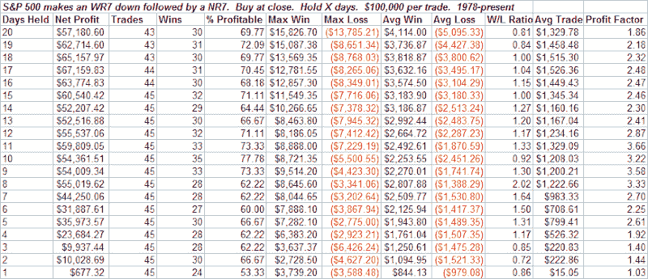
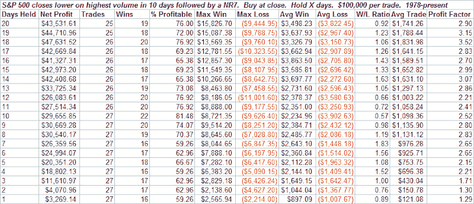

<!--yml
category: 未分类
date: 2024-05-18 08:14:01
-->

# Quantifiable Edges: Selling Quiets During Narrow Range Day

> 来源：[http://quantifiableedges.blogspot.com/2008/06/selling-quiets-during-narrow-range-day.html#0001-01-01](http://quantifiableedges.blogspot.com/2008/06/selling-quiets-during-narrow-range-day.html#0001-01-01)

I’ve discussed the pattern of a

[WR7 down followed by an NR7 in the past](http://quantifiableedges.blogspot.com/2008/04/what-happens-when-range-rapidly.html)

. Generally it’s had bullish implications over the short-term. When applied to a chart of the S&P 500 rather than SPY or the Nasdaq, the formations look a little different. This is because the S&P 500 has a staggered opening. Therefore the chart is basically gapless. These bars therefore more often look at true range rather than a bar with a large gap. Applying the WR7down – NR7 study to the S&P 500 chart yields the following results:

As in the Nasdaq study, WR7 down – NR7 implications appear bullish.

Another way to look at the last two days would be to ignore the size of the bar on Friday, and rather focus on the high level of volume. This next study does that:

Both studies seem to suggest the same thing. When a substantial selloff (measured in either price or volume) rapidly loses steam, the result is typically a bounce back up.

Also notable is the fact that the CBI hit “8” today. To see recently reported results following moves to 7 or higher, see

[the June 11th blog](http://quantifiableedges.blogspot.com/2008/06/cbi-hits-7-some-hypothetical-results.html)

.

On the negative side, the

[VIX didn’t budge](http://quantifiableedges.blogspot.com/2008/06/selloff-doesnt-scare-vix.html)

, the Put/Call ratio dropped precipitously, and it looks like another possible case of

[Draggin’ Breadth](http://quantifiableedges.blogspot.com/2008/06/draggin-breadth.html)

today.

Lastly, while the studies help to construct a market bias, the biggest mover in the next few days may be the Fed. Right now, that seems to be a wild card that could spark a move in either direction.