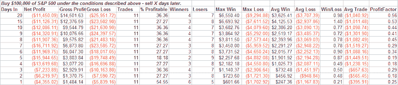
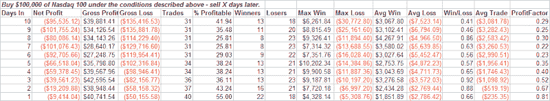

<!--yml
category: 未分类
date: 2024-05-18 08:27:39
-->

# Quantifiable Edges: Sharp Drops In Consolidations - Bad News

> 来源：[http://quantifiableedges.blogspot.com/2008/04/sharp-drops-in-consolidations-bad-news.html#0001-01-01](http://quantifiableedges.blogspot.com/2008/04/sharp-drops-in-consolidations-bad-news.html#0001-01-01)

Friday the market got ugly. The S&P sold of more than 2% and the NDX dropped almost 3%. My take is that we have a strong selloff within a consolidation period. The market is trading right where it has been many, many times since the 3rd week in January. The sideways action of the last 2-3 weeks is basically a continuation of the sideways action over the last 2-3 months. As most traders are aware, markets act differently depending on their overall direction. Uptrends have different characteristics than downtrends which have different characteristics than sideways markets. So I decided to take a look at market performance following a strong selloff in a sideways market. First I tested the S&P 500 under the following conditions:

1) Dropped at least 2% today.

2) Did not make a 10-day closing low. (Suggesting no breakdown.)

3) 14-period ADX is less than 20\. (Suggesting congestion.)

Buying when these conditions occurred and selling “X” days later produced the following results looking back to 1960:

Negative expectations and very low % profitable. Quite negative on a small sample size even as far out as 4 weeks. For those that would like to take a closer look, here are the dates: 6/23/70,12/02/74, 1/7/81, 4/14/88, 5/14/99, 2/9/00, 1/5/01, 10/29/01, 9/12/02, 11/1/07, 12/11/07, 4/11/08.

To gain a larger sample size, I decided to look at the NDX, which historically has been more volatile. In this case I required a 2.5% drop (instead of 2%) and kept the other requirements the same - no closing 10-day low and a 14-period ADX below 20\. With less historical data this test only ran back to 1986\. Below are those results:

More of the same here.

Strong pullbacks in strong uptrends may be buyable. Strong pullback in consolidations, on the other hand, have historically led to more downside. Based on this study, caution seems warranted.