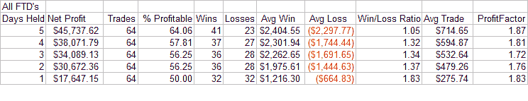
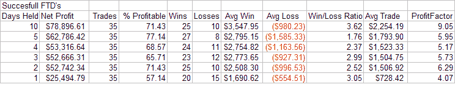
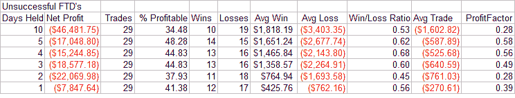

<!--yml
category: 未分类
date: 2024-05-18 08:35:39
-->

# Quantifiable Edges: Short-term Implications of Follow Through Days

> 来源：[http://quantifiableedges.blogspot.com/2008/02/short-term-implications-of-follow.html#0001-01-01](http://quantifiableedges.blogspot.com/2008/02/short-term-implications-of-follow.html#0001-01-01)

Time for CANSLIM traders to go back to work. An IBD Follow Through Day triggered today. At Quantifiable Edges I’ve discussed the intermediate-term implications of Follow Through Days in great detail. Catch the entire series so far below:

While intermediate-term traders are rejoicing with today’s Follow Through Day, swing traders are noting how overbought the market has become on a short-term basis. Most of what I’ve read by short-term traders this afternoon and evening has been short-oriented. The prevailing theme is that we are now short-term overbought in a longer-term downtrend (or bear for some). Most people believe these are ideal conditions for shorting.

What swing traders looking to short need to understand is that nearly *every* Follow Through Day produces short-term overbought conditions in a downtrending market. They frequently arrive within 4-7 days of a bottom. Today was day 7 of the rally. As it was last week, most of the time the reversal off that bottom is violent. This can cause oscillators to become overbought. When the formula calls for a typically violent reversal, a week of gains, and a strong rally on high volume to cap it off – you’re bound to be overbought short-term. Does that mean it’s a good time to try a swing trade short?

To test it I looked at the 1-5 day returns of all 64 Follow Through Days listed in my study. $100,000 per trade. Go long on the close of the Follow Through Day. Exit X days later. Results below:

More often than not the market trades higher over the next 1-5 days. The average win is larger than the average loss. Profits continue to be made on the long-side. Shorting is a losing game in this scenario. Perhaps this disbelief by short-term traders is what helps to continue to fuel the rally as they are constantly forced to cover their losing positions.

***Is short-term success or failure indicative of long-term success or failure?*** 

One interesting claim that IBD sometimes makes about Follow Through Days is that those that fail normally do so shortly after the Follow Through Day. I decided to also look at this concept tonight.

I broke the 64 Follow Through Days in my study up into two groups – the successful ones and the unsuccessful ones – to see if their early performance hinted at their chance of longer-term success. Below are the breakdowns – same as above - $100,000/trade, long at the close of the Follow Through Day, and exit X days later.

Early action after Follow Through Days that eventually “succeeded”:

Right off the bat most of these posted nice gains. The short-term winners among the group averaged another 2-3% upside in the first week. The short-term losers suffered 1-1.5% drops on average. Net profits were substantial.

Early action after Follow Through Days that eventually “failed”:

Those that eventually failed tended to show signs of failure right away. Notable here is the average loss was appreciably higher than the average gain.

A basic rule of thumb is that the success or failure was determined with about 67% reliability within the first week after a Follow Through Day. For instance, note there were 41 total trades that were in the black after 5 days. About 2/3 of them went on to “successful” rallies. The same ratio applies for the losers. There were 23 losers after 5 days. 15 of them ended up with “failed” rallies and the other 8 were “successful”. The 2/3 rule holds fairly accurate whether you are looking at winners or losers over any period from 1-5 days after the Follow Through Day. The Unemployment Report tomorrow morning has a chance to set the tone early on in this one.

To summarize the two main points tonight:

1) Don’t be too eager to short. It’s doesn’t have positive expected value just after a Follow Through Day.

2) Watch market action closely over the next week. It should give you a pretty good indication of the intermediate-term.