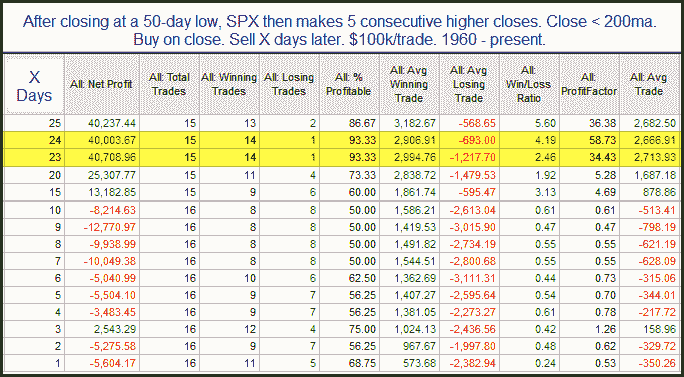

<!--yml
category: 未分类
date: 2024-05-18 12:57:13
-->

# Quantifiable Edges: Short-term Persistence a Positive For the Intermediate-term

> 来源：[http://quantifiableedges.blogspot.com/2010/07/short-term-persistence-positive-for.html#0001-01-01](http://quantifiableedges.blogspot.com/2010/07/short-term-persistence-positive-for.html#0001-01-01)

Monday marked the 5th higher close in a row. This kind of persistence coming off a low has almost always led to further upside over the intermediate-term. This can be seen in the study below.

Short-term returns were very choppy. Looking out a month or so the results strongly favor the bulls. In last night's Subscriber Letter I listed all the instances. What was interesting is that there was positive representation from every decade.