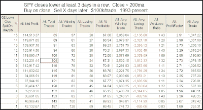

<!--yml
category: 未分类
date: 2024-05-18 13:19:05
-->

# Quantifiable Edges: Slowing Rate of Decline Potentially Short-term Bullish

> 来源：[http://quantifiableedges.blogspot.com/2009/06/slowing-rate-of-decline-potentially.html#0001-01-01](http://quantifiableedges.blogspot.com/2009/06/slowing-rate-of-decline-potentially.html#0001-01-01)

Also notable about Wednesday’s action was that while the market has declined for at least 3 days in a row, the rate of decline has lessened both of the last 2 days.

[Back in September I found this pattern to have bullish consequences](http://quantifiableedges.blogspot.com/2008/09/slowing-rate-of-decline-helps-bullish.html)

when the market was trading below its 200-day moving average. I decided to test it out when above the 200ma as well. I found that prior to 1987 there was no bullish influence based on the pattern. Since 1987 one has appeared. Here is the test using the SPY. First the base case without the slowing rate of decline requirement.

(click table to enlarge)

Closing down AT LEAST (rather than exactly) 3 days in a row has been bullish over the period. Now let’s add the slowing rate of decline requirement:

(click table to enlarge)

Results here are quite a bit stronger than the base case.