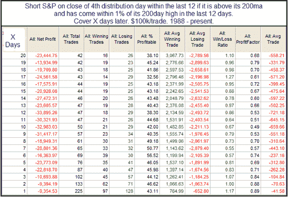

<!--yml
category: 未分类
date: 2024-05-18 13:01:57
-->

# Quantifiable Edges: Some Early-Stage Volume Research

> 来源：[http://quantifiableedges.blogspot.com/2010/04/some-early-stage-volume-research.html#0001-01-01](http://quantifiableedges.blogspot.com/2010/04/some-early-stage-volume-research.html#0001-01-01)

The Subscriber Letter has shown several studies lately that have suggested some of the low-volume rallies we are seeing will often lead to a pullback. It struck me that perhaps it might be worth looking at low-volume rallies in a slightly different way.

One tool that some analysts use is the concept of Distribution Days. Distribution days are basically days where the market sells off on relatively high volume. The theory is that when clusters of these days are seen near a market high it suggests an intermediate-term selloff is likely to ensue. Back in August I posted a study that examined this.

[It found the concept to be dead wrong](http://quantifiableedges.blogspot.com/2009/08/distribution-days-quantified.html)

. It is most often better to buy into these clusters of high-volume selloffs rather than looking for further selling.

Below I re-ran the results of that August study back to 1988 using the same parameters.

Recall that this study looks to go short, rather than buy. Therefore you are looking at a market that typically rose following such clusters.

Next, instead of looking for clusters of distribution days, I decided to substitute days that rose on volume that was lower than the pervious day’s volume. Here’s how those results came out.

It’s interesting to see here that results are mixed rather than suggestive of upside as the distribution day clusters were. This isn’t terribly surprising since many of the volume-related studies we see suggesting downside are due to low-volume rises rather than high-volume declines.

At this point the research is a bit half-baked, but I plan on expanding on this line of thought in the future.