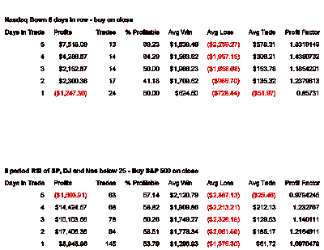

<!--yml
category: 未分类
date: 2024-05-18 08:37:28
-->

# Quantifiable Edges: Some Hard Data I Looked At Last Night

> 来源：[http://quantifiableedges.blogspot.com/2008/01/some-hard-data-i-looked-at-last-night.html#0001-01-01](http://quantifiableedges.blogspot.com/2008/01/some-hard-data-i-looked-at-last-night.html#0001-01-01)

I saw several articles and blogs today that suggested strong upside

edges

were in place. This

opposed

my findings from last night. Only one of these bothered to show any statistics. When I saw this I decided I had made a mistake in not showing data to go along with my comments. Below are two studies that typified what I was seeing last night.

The first looks at buying the

Nasdaq

any time it closes lower 8 days in a row and selling X days later.

The second looks at buying the S&P 500 any time the S&P, Dow and

Nasdaq

all close with an 8-period RSI below 25 and selling X days later.

$100,000 per trade.

I found no compelling evidence for an immediate bounce with these studies. When adding additional trend and breakdown filters as I mentioned last night, the numbers looked even worse.

Perhaps a true washout or a solid reversal could get us the quantifiable edge we seek...