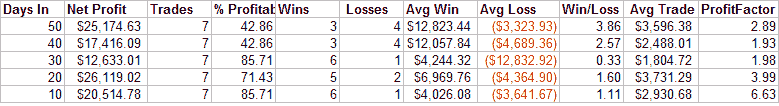

<!--yml
category: 未分类
date: 2024-05-18 08:29:07
-->

# Quantifiable Edges: Some Historical Comparisons

> 来源：[http://quantifiableedges.blogspot.com/2008/04/some-historical-comparisons.html#0001-01-01](http://quantifiableedges.blogspot.com/2008/04/some-historical-comparisons.html#0001-01-01)

On Tuesday the SPY gapped up over 1.25%. Hopefully readers of the blog recalled that this was not a signal to either go short or take profits on longs.

[Large gaps up during downtrending markets](http://quantifiableedges.blogspot.com/2008/03/large-gaps-higher-in-uptrends-vs.html)

have a tendency to trap shorts and lead to further intraday gains. This was the case today as the S&P 500 and Nasdaq Composite both finished up over 3.5%.

On

[March 19th](http://quantifiableedges.blogspot.com/2008/03/history-says-to-expect-more-upside-in.html)

I ran a study that looked at market performance following two 3.5% up days in the S&P 500 within 10 trading days. Results following this type of occurrence were quite bullish over the next 2-6 weeks. There were also some major bottoms identified. Below is a copy of the results table I displayed that day (therefore it doesn’t include the March 19th, 2008 occurrence). $100,000 per trade.

Today we once again saw the 2nd day in the last two weeks to make a 3.5% gain. In fact, that now makes 3 times in 15 trading days. That has only happened two other times since 1960: October of 1987 and October of 2002\. Those dates may sound familiar. I posted graphs of those two periods in my

[March 20th](http://quantifiableedges.blogspot.com/2008/03/big-drop-after-big-up-day-rarity-that.html)

column. They were the only two times other than March 19th and 20th that saw the market rise 4% one day and then drop 2.4% the next (since 1960).

The market continues to provide incredible volatility. In the past this volatility has been associated with intermediate or long-term bottoms. There was probably a fair amount of short covering today. There was also probably a fair amount of short covering in October 1987 and October 2002.

On its own it would be very dangerous to read too much into a study with just two prior occurrences. Taken together with

[all of the previous intermediate-term studies](http://quantifiableedges.blogspot.com/2008/03/review-of-recent-studies.html)

I’ve referenced over the last few weeks, today’s action acts as confirmation that the market should put in generally higher prices over at least the next several weeks.

If you use Tradestation and would like to purchase and download tonight’s study, you may do so

[here](http://www.quantifiableedges.com/studies.html)

. (It’s also included in the March 19th package.)