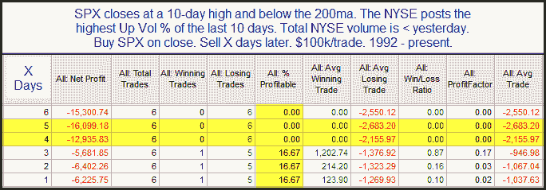

<!--yml
category: 未分类
date: 2024-05-18 12:54:55
-->

# Quantifiable Edges: Some Short-term Bearish Evidence

> 来源：[http://quantifiableedges.blogspot.com/2010/09/some-short-term-bearish-evidence.html#0001-01-01](http://quantifiableedges.blogspot.com/2010/09/some-short-term-bearish-evidence.html#0001-01-01)

I'm seeing some evidence suggesting the market has quickly become overdone to the upside and is likely to pull back. Below is one study from last night's subscriber letter that looks at other times the SPX made short-term highs on strong breadth but weak volume while in a long-term downtrend.

Instances are very low and prior to 1992 there did not appear to be an edge. So I wouldn't try and extract too much from these results but I do think the recent downward strength and consistency is notable.