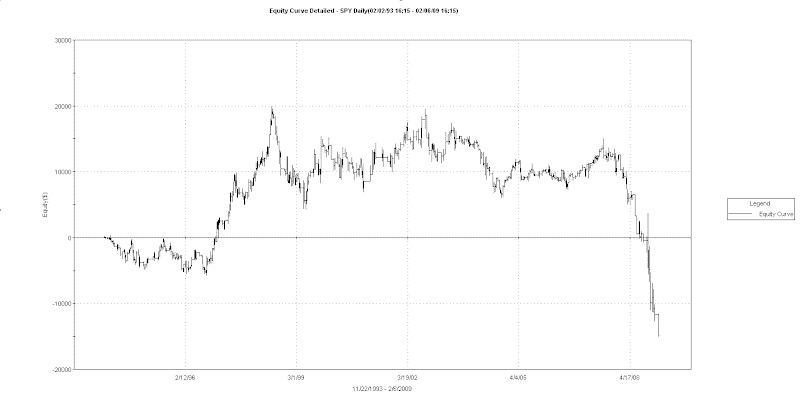

<!--yml
category: 未分类
date: 2024-05-18 13:28:06
-->

# Quantifiable Edges: Some Thoughts On Bear-Only Edges

> 来源：[http://quantifiableedges.blogspot.com/2009/02/some-thoughts-on-bear-only-edges.html#0001-01-01](http://quantifiableedges.blogspot.com/2009/02/some-thoughts-on-bear-only-edges.html#0001-01-01)

One study I looked at this weekend was how the market reacted following times when the SPY gapped higher, never traded down to the previous day’s close, and closed above its open as it did on Friday. Friday was a bit of a borderline example since the gap was small and it came within 1 cent of filling the overnight gap, but the results were interesting nonetheless. Rather than use a results table as I normally do I decided to show an equity curve of this study. The equity curve assumes a 5-day exit. It may be a bit difficult to read the dates below. The test was run from the SPY inception in 1993 though 2/6/09.

What I see is an incredibly strong and consistent tendency to reverse and trade lower has been evident since the bear market began in late 2007\. This tendency did not exist prior to that. It is worth taking note of such test results for a couple of reasons: 1) To understand how the market is reacting to such setups currently (or in the recent past). By knowing what the market current tendency is you can position yourself to take advantage of it. 2) To consider possible implications if these kind of setups stop preceding strong negative market reactions. The bear market reaction has been extremely negative. If negative reactions to this or other similar bear-only studies stop occurring it could signal a shift in market dynamics and a possible rally.