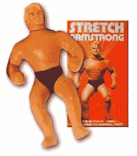
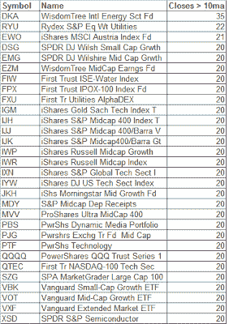

<!--yml
category: 未分类
date: 2024-05-18 08:17:38
-->

# Quantifiable Edges: Stretched ETF's

> 来源：[http://quantifiableedges.blogspot.com/2008/05/stretched-etfs.html#0001-01-01](http://quantifiableedges.blogspot.com/2008/05/stretched-etfs.html#0001-01-01)

In the last few nights I’ve talked about

[Time Stretches](http://quantifiableedges.blogspot.com/2008/05/subscriber-letter-time-stretch-system.html)

and I’ve discussed my

[newly bearish outlook](http://quantifiableedges.blogspot.com/2008/05/what-extremely-low-volume-on-monday-may.html)

. In the spirit of those concepts, tonight I present a list of ETF’s that has gone at least 20 days without closing below their 10-day simple moving averages.

