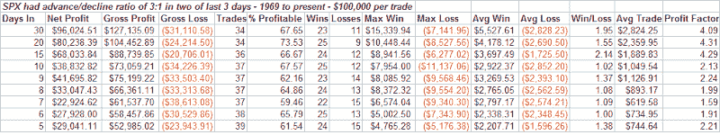

<!--yml
category: 未分类
date: 2024-05-18 08:26:36
-->

# Quantifiable Edges: Strong Breadth To Finish The Week

> 来源：[http://quantifiableedges.blogspot.com/2008/04/strong-breadth-to-finish-week.html#0001-01-01](http://quantifiableedges.blogspot.com/2008/04/strong-breadth-to-finish-week.html#0001-01-01)

A quick breadth study to share with you this morning. Wednesday and Friday’s rallies were both accompanied by strong breadth figures as advancers outnumbered decliners by more than 3 to 1\. I looked back to 1969 to see how the market performed in the past when breadth readings were at least 3 to 1 positive in two of three days. Results below:

These results appear strongly favorable. The average week over the sample period returned 0.175%. The results above beat the average by more than 3 to 1 from 1 to 4 weeks out. Last week's action appears quite bullish.