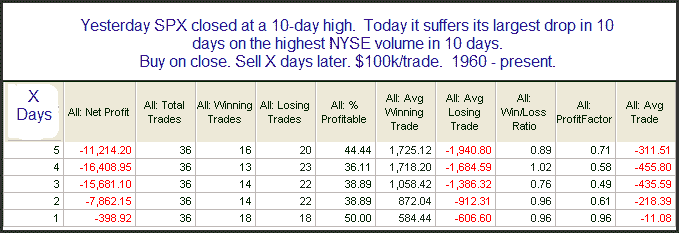

<!--yml
category: 未分类
date: 2024-05-18 13:12:05
-->

# Quantifiable Edges: Strong Drops From Highs

> 来源：[http://quantifiableedges.blogspot.com/2009/10/strong-drops-from-highs.html#0001-01-01](http://quantifiableedges.blogspot.com/2009/10/strong-drops-from-highs.html#0001-01-01)

When strong moves down occur from high levels as happened on Friday, there is often a bit more downside follow through. Below is a study that exemplifies this.

Certainly not an overwhelming edge, but a hint that there could be more selling before a bounce occurs.

BTW, watch out this week for a few exciting announcements from Quantifiable Edges!