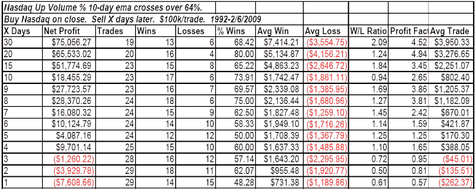

<!--yml
category: 未分类
date: 2024-05-18 13:17:36
-->

# Quantifiable Edges: Strong Nasdaq Breadth Intermediate-term Bullish

> 来源：[http://quantifiableedges.blogspot.com/2009/07/strong-nasdaq-breadth-intermediate-term.html#0001-01-01](http://quantifiableedges.blogspot.com/2009/07/strong-nasdaq-breadth-intermediate-term.html#0001-01-01)

One of the positives I'm seeing in the market right now is the extremely strong breadth. In the last week or so several breadth related studies have triggered that suggest more upside. Below is a study from the 2/6/09 Subscriber Letter. It was identified last night by

[the Quantifinder](http://quantifiableedges.blogspot.com/2009/05/quantifinder-unveiled.html)

for both

[gold and silver subscribers](http://www.quantifiableedges.com/meminfo.html)

.

The study uses an indicator that I track on the charts page. It looks at the % of Nasdaq up volume on a daily basis. It then calculates a 10-day ema of the result. (I did not have time to update the results this morning.)

The long-term implications were strongly bullish. The very short-term was questionable, and there was often a bit of a pullback at some point early on.