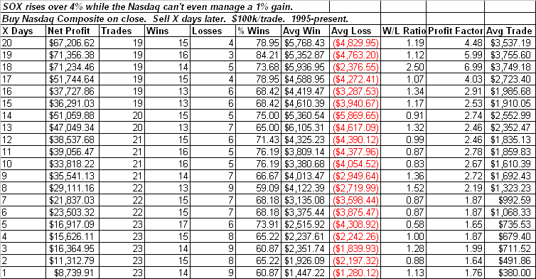

<!--yml
category: 未分类
date: 2024-05-18 13:29:02
-->

# Quantifiable Edges: Strong SOX Action Could Be Good For Nasdaq

> 来源：[http://quantifiableedges.blogspot.com/2009/01/strong-sox-action-could-be-good-for.html#0001-01-01](http://quantifiableedges.blogspot.com/2009/01/strong-sox-action-could-be-good-for.html#0001-01-01)

I’ve discussed in the past the fact

[that strong SOX action can often be a good harbinger](http://quantifiableedges.blogspot.com/2008/08/sox-bucks-selloff-again.html)

for the the market. While both the S&P 500 and the Nasdaq failed to gain even 1% on Friday, the SOX rose more than 4%. It’s especially unusual for the SOX to post such strong gains without bringing the Nasdaq composite along with it. It has provided a nicely bullish expectation for the Nasdaq going forward.

