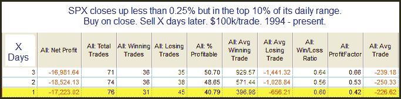

<!--yml
category: 未分类
date: 2024-05-18 13:01:22
-->

# Quantifiable Edges: Strong Upside Reversal Eeks Out Small Gain

> 来源：[http://quantifiableedges.blogspot.com/2010/04/strong-upside-reversal-eeeks-out-small.html#0001-01-01](http://quantifiableedges.blogspot.com/2010/04/strong-upside-reversal-eeeks-out-small.html#0001-01-01)

It took a strong turnaround to get the SPX back into positive territory by Thursday’s close. I looked at this several different ways last night in the Subscriber Letter. Below is one study I ran that suggested mildly bearish implications.

This seems to indicate that when it takes a lot to close up just a little you’re likely to see a pullback short-term. Not a huge edge here, but some suggestion that the SPX could struggle the next day or two. I wouldn’t normally base a trade solely on this, but I do think it is worth noting and keeping in the “bag of tricks”.