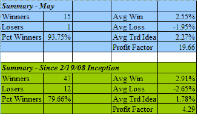
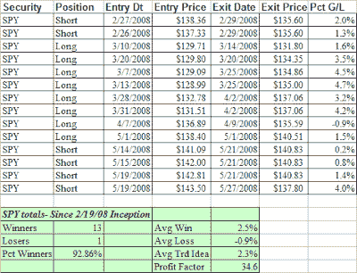

<!--yml
category: 未分类
date: 2024-05-18 08:16:00
-->

# Quantifiable Edges: Subscriber Letter Results For May

> 来源：[http://quantifiableedges.blogspot.com/2008/05/subscriber-letter-results-for-may.html#0001-01-01](http://quantifiableedges.blogspot.com/2008/05/subscriber-letter-results-for-may.html#0001-01-01)

Below are the summary results for the trade ideas that were closed during the month of May. Results in May were above average in most areas.

A few notes:

The above results do not include currently open trade ideas.

All trade ideas come with specific entry and exit criteria and are tracked daily.

All trade ideas are in highly liquid stocks and ETF’s. The Quantifiable Edges Subscriber Letter does not deal with small caps.

All trade ideas are quantified through testing prior to entry. Subscribers may use the backtest results to help judge whether the idea may be appropriate for them.

This is not a performance report. I don’t know subscriber’s financial situations and risk tolerances. Therefore I do not suggest trade sizes.

There are essentially 3 kinds of trade ideas: 1) CBI trades, 2) System trades, and 3) Index trades.

For those that may be interested in the Index trades, they mostly use the S&P 500\. All S&P index trades are entered using SPY. I don’t use leveraged etf’s like SDS or SSO to juice the performance numbers. Many times I will suggest scaling in to these trades in either 3 or 4 parts. Below are all SPY trade ideas that received fills since the 2/19/2008 inception:

If you’d like to either take advantage of Quantifiable Edges market timing, track the individual trades that construct CBI, or learn new systems (

[like this one](http://quantifiableedges.blogspot.com/2008/05/subscriber-letter-time-stretch-system.html)

) whose code is available for subscribers to download into Tradestation, you may want to give the Quantifiable Edges Subscriber Letter a look. For a free 3-day trial simply send an email with your name and email address to

[QuantEdges@HannaCapital.com](mailto:QuantEdges@HannaCapital.com)

For further information or to subscribe,

[click here](http://www.quantifiableedges.com/letter.html)

.