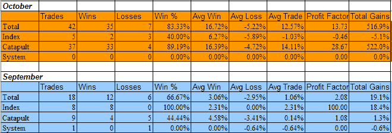

<!--yml
category: 未分类
date: 2024-05-18 13:34:51
-->

# Quantifiable Edges: Subscriber Letter Scorecard for October

> 来源：[http://quantifiableedges.blogspot.com/2008/11/subscriber-letter-scorecard-for-october.html#0001-01-01](http://quantifiableedges.blogspot.com/2008/11/subscriber-letter-scorecard-for-october.html#0001-01-01)

October may have been the worst month in a long time for the stock market, but it was the best month ever for the

[Subscriber Letter](http://www.quantifiableedges.com/letter.html)

. The primary strategy responsible for the oversized trading profits were the Catapult trades, which combined comprise the CBI. They also performed well during the January and March selloffs, but suffered an unusually difficult period during the June/July selloff.

Before revealing the results, some important notes:

I don’t suggest position sizes. The primary reason for this is I’m not acting as a financial advisor. I don’t feel it is appropriate to suggest allocation sizes without understanding someone’s financial situation and risk tolerance. Even for my own trading I run different portfolios with different levels of aggressiveness. For instance, my most aggressive portfolio is my IRA. Here I may use options to sometimes get 400-500% leveraged. Other portfolios on the other hand normally take much more conservative stances and some rarely reach or exceed 100% exposure.

Since I don’t suggest position sizes this is should not be considered a performance report, but rather a trade idea scorecard. Therefore, no matter how objective I try to be the reporting of the results is always going to be skewed depending on how you approach the trades. For instance, I always recommend scaling into the Catapult positions in 3 parts, whereas the “System” trades (whatever system I unveil other than Catapult) are normally one entry. The “QE Index” trades I normally recommend scaling into as well. For my own trading I trade much larger size with the index trades than any of the individuals. I also control my exposure by limiting the total amount invested per day. As I mentioned, this will vary depending on the account I’m trading. My most aggressive account I may put in up to 100%/day and get heavily leveraged using options. A more conservative account may max out at 15%-20% per day.

It’s unlikely anyone would have taken all of the trades with equal amounts, so personal results would vary greatly depending on the trader’s approach. Still, there was more than ample opportunity to take advantage of the Quantifiable Edges trade ideas in October. With all those caveats in mind, recent results are listed below and broken down by category. Since October was so unusual, I’ve also shown the September results below.

If you’d like a free 3-day trial of the Quantifiable Edges Subscriber Letter, just shoot an email to

**[QuantEdges@HannaCapital.com](mailto:QuantEdges@HannaCapital.com)**

and include your name and email address.