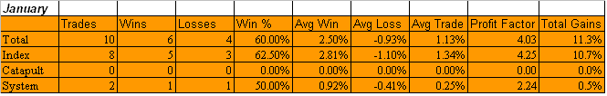

<!--yml
category: 未分类
date: 2024-05-18 13:28:22
-->

# Quantifiable Edges: Subscriber Letter Trade Results For January

> 来源：[http://quantifiableedges.blogspot.com/2009/02/subscriber-letter-trade-results-for.html#0001-01-01](http://quantifiableedges.blogspot.com/2009/02/subscriber-letter-trade-results-for.html#0001-01-01)

Like December, January was a bit slow for trade ideas. A big reason for this was that there were no Catapult trade ideas that filled. There were several that triggered on 1/20 but the gap up on 1/21 kept them from receiving fills.

I only tracked 2 “system” trades in the Subscriber Letter during January. Subscribers that may trade more aggressively than me can find additional setups almost every night in S&P 500 stocks as well as ETF’s by checking the “System Triggers” page in the members section of the website.

The “Index” trades are typically SPY and QQQQ trades based on the short-term market outlook section of the Letter. The outlook is based on edges identified in my market studies. One tool I use to quantify the different studies is

[the Aggregator](http://quantifiableedges.blogspot.com/2008/07/quantifiable-edges-aggregator.html)

.

Now for the usual caveats and explanations before unveiling the results.

*I don’t suggest position sizes. The primary reason for this is I’m not acting as a financial advisor. I don’t feel it is appropriate to suggest allocation sizes without understanding someone’s financial situation and risk tolerance. Even for my own trading I run different portfolios with different levels of aggressiveness. For instance, my most aggressive portfolio is my IRA. Here I may use options to sometimes get 400-500% leveraged. Other portfolios on the other hand normally take much more conservative stances and some rarely reach or exceed 100% exposure.***Since I don’t suggest position sizes this is should not be considered a performance report, but rather a trade idea scorecard. Therefore, no matter how objective I try to be the reporting of the results is always going to be skewed depending on how you approach the trades. For instance, I always recommend scaling into the Catapult positions in 3 parts, whereas the “System” trades (whatever system I unveil other than Catapult) are normally one entry. The “Index” trades I normally recommend scaling into as well. For my own trading I trade much larger size with the index trades than any of the individuals. I also control my exposure by limiting the total amount invested per day. As I mentioned, this will vary depending on the account I’m trading. My most aggressive account I may put in up to 100%/day and get heavily leveraged using options. A more conservative account may max out at 15%-20% per day.**It’s unlikely anyone would have taken all of the trades with equal amounts, so personal results would vary greatly depending on the trader’s approach.*

All that aside, below are January’s results (click to enlarge):

If you'd like to try out a Quantifiable Edges subscription then

[click here for a free 1-week trial](http://www.quantifiableedges.com/members/register.php)

. (Only a name and email address are required.) For complete subscription information to the

[Gold package click here](http://www.quantifiableedges.com/gold.html)

.*