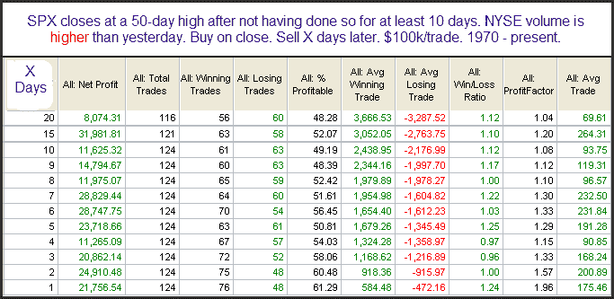

<!--yml
category: 未分类
date: 2024-05-18 13:03:29
-->

# Quantifiable Edges: Testing Common Knowledge About Volume On An SPX Breakout

> 来源：[http://quantifiableedges.blogspot.com/2010/03/testing-common-knowledge-about-volume.html#0001-01-01](http://quantifiableedges.blogspot.com/2010/03/testing-common-knowledge-about-volume.html#0001-01-01)

In last night’s Subscriber Letter I looked at the breakout to a new closing high in the S&P 500\. I defined a breakout to be a close at a 50-day high after having no closes at a 50-day high for at least 10 days. In general these breakouts showed positive momentum for about a week and then fizzled out. I broke down the breakouts a number of different ways. One way was by using volume. I wanted to test the common supposition that high volume was better when an index broke out. Those results were quite interesting and I’ve included them below. First instances like yesterday with lower NYSE volume.

Here we see a solid inclination for some upside follow through over the next week. But how does this compare to those times that the volume came in higher on the day of the breakout?

What was a decent edge over the first week is now essentially edgeless. Many times on this blog I’ve shown how common trading knowledge is often wrong. This serves as yet another example of why it is important to question common knowledge.

If you’d like to see more results related to my study of breakouts last night you may you may take a free 1-week trial of Quantifiable Edges by

[signing up here](http://www.quantifiableedges.com/members/register.php)

. If you’ve trialed in the past but not in a while, then you may email me at support @ quantifiable edges.com (no spaces).