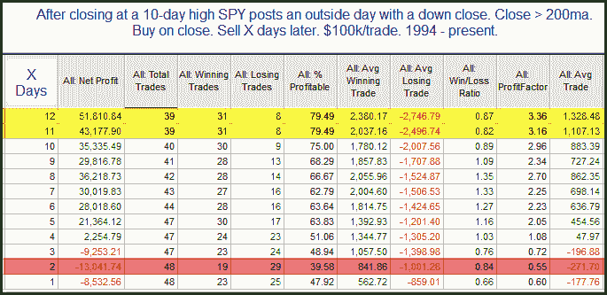

<!--yml
category: 未分类
date: 2024-05-18 12:54:17
-->

# Quantifiable Edges: Testing Tuesday's Outside Bar

> 来源：[http://quantifiableedges.blogspot.com/2010/09/testing-tuesdays-outside-bar.html#0001-01-01](http://quantifiableedges.blogspot.com/2010/09/testing-tuesdays-outside-bar.html#0001-01-01)

I found it interesting that the SPY put in an outside day and closed down after closing at a short-term high Monday. Outside reversal bars such as Tuesday's are often viewed as bearish by many traders. I ran a study to examine the potential significance of this kind of bar.

Results here are similar to other studies I’ve run on outside day or key reversal bars in the past. It is often followed by a few days of weakness but it rarely marks the kind of significant top it is renowned for.

Recall though that Monday's study did suggest the possibility of an intermediate-term top, so it is a possibility. In any case, a few days of weakness here would be typical.