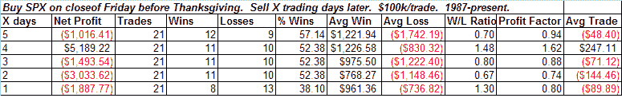

<!--yml
category: 未分类
date: 2024-05-18 13:33:16
-->

# Quantifiable Edges: Thanksgiving Edge?

> 来源：[http://quantifiableedges.blogspot.com/2008/11/thanksgiving-edge.html#0001-01-01](http://quantifiableedges.blogspot.com/2008/11/thanksgiving-edge.html#0001-01-01)

I’ve often heard about the positive tendencies of the market to rally Thanksgiving week. So I ran a quick test:

The above results actually go through the Monday following Thanksgiving. Positive tendencies may have existed in the distant past, but over the 21-year period I looked at there doesn’t appear to be any edge – bullish or bearish.

The market rallied hard on Friday after hitting historically extreme conditions. There are reasons to be optimistic about some follow-through this week. Thanksgiving doesn’t appear to be one of those reasons, though.