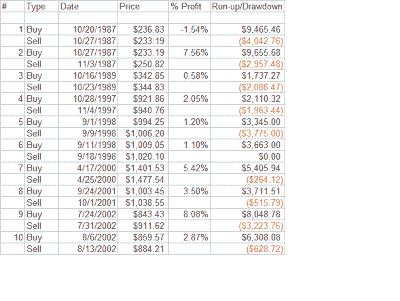

<!--yml
category: 未分类
date: 2024-05-18 08:36:18
-->

# Quantifiable Edges: The CBI, Reversals, and Bear Market Rallies

> 来源：[http://quantifiableedges.blogspot.com/2008/01/cbi-reversals-and-bear-market-rallies.html#0001-01-01](http://quantifiableedges.blogspot.com/2008/01/cbi-reversals-and-bear-market-rallies.html#0001-01-01)

Quite a day today. For those of you who “missed” the reversal – don’t sweat it. My studies indicate there’s plenty of upside left. Let’s first review and update things we’ve already looked at. Then I’ll show some new stats.

**Capitulative Breadth Indicator (CBI)** 

The CBI remained at 13 today. It normally takes more than one day of buying to significantly reduce the number. The exit signal for this model will come when the CBI closes at 3 or lower. I’ve discussed it in great detail in the last several days. If you missed those posts and want to read up on it, just click the CBI label at the bottom of this post.

**[Time Stretch Study](http://quantifiableedges.blogspot.com/2008/01/time-cbi-indicate-bounce-could-be-near.html)** 

Although I didn’t post this study until Sunday night, the study used Friday’s closing price as the presumed entry point. Amazingly, even with an entry as bad a Friday’s close, this study is currently 1% in the black.

**Large Reversal Bar Study**

The criteria for the reversal bar study on January 9th was the S&P 500 makes a 20-day low and closes greater than 1% higher on increased volume over the previous day. We met those criteria again today. While the Jan. 9th reversal bar ultimately failed, it wasn’t before opportunities for profit, or at least a scratch, made themselves available. Traders may want to go back and review

[that study](http://quantifiableedges.blogspot.com/2008/01/do-reversal-bars-really-work.html)

and the subsequent

[trade management follow-up post](http://quantifiableedges.blogspot.com/2008/01/reversal-bar-study-trade-management.html)

as they both apply again today.

**Large Bars Down and Up**

What stood out over the last few days was the volatility and extremely wide range that the market traded in. I did a study looking at these two-bar reversals rather than just looking at the single bar reversal like above. Below are the results: (click table to enlarge)

All of the key stats here look pretty good. An average return of over 3% on a short-term index trade is always eye-catching. I also like the Win/Loss Ratios and Profit Factors (Profit Factor = Gross Profit / Gross Loss). There are fewer trades listed when the trades lasted more than 1 week because the setup occurred again a short time later and I didn’t want to double-count the stats for those instances. I’ve listed all the trades with a 5-day exit below.

*A few notable things here:* *1) All but one of these trades saw a pullback within the first five days. The lone holdout (9/11/98) pulled back below its entry price intraday on Day 6\. Most of the pullbacks were 2% or more. As in the previous reversal bar study, this indicates it is likely unnecessary to chase an entry.

2) All of the instances led to a decent rally at some point beyond the five days shown. Five of the seven groups saw retests before their rallies. These were 10/87, 10/89, 9/98, 4/00, and 7-8/2002\. The other two – 10/97 and 9/01 marked the bottom.

3) While the setup has occurred only ten times in the last 30 years, 3 of those times it happened within two weeks of a previous instance. The volatility experienced over the two-day reversal period did not dissipate quickly. This indicates the ride will likely remain a wild one.

**Summary** Today was a good start. I believe in the days and perhaps weeks to come there is going to be more volatility and ultimately more upside. While I normally like to stick to the numbers in this blog, logically it makes sense to me that we get some upside here. Here’s my thought process. It seems the whole world is convinced we’re in a bear market. Most of what I see and hear is saying “sell into any rallies”. It is this disbelief which should help fuel to the rise. This may or may not be “the” bottom. If it is, then we will certainly see a nice rally. If it isn’t “the” bottom the rally should still be nice enough to suck in a good number of people before the next serious leg down begins. That’s what bear-market rallies do. They make believers out of suckers then take their money. In either case my studies indicate the rally should be strong enough to grab some profits. Just peek at the trades listed above – several of them were of the Bear Market Rally variety. So have we hit “the” bottom? I have no idea, but I’ll be re-evaluating all along the way.*