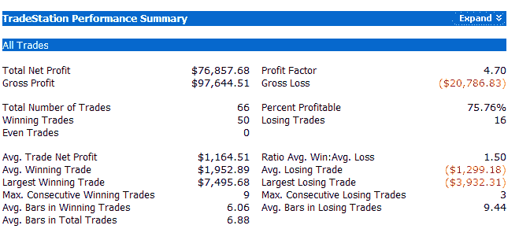

<!--yml
category: 未分类
date: 2024-05-18 08:16:27
-->

# Quantifiable Edges: The CBI Wakes Up

> 来源：[http://quantifiableedges.blogspot.com/2008/05/cbi-wakes-up.html#0001-01-01](http://quantifiableedges.blogspot.com/2008/05/cbi-wakes-up.html#0001-01-01)

The CBI has begun to wake up this past week. For those new to the blog CBI stands for Capitulative Breadth Indicator. An introduction to it is

[here](http://quantifiableedges.blogspot.com/2008/01/my-capitulative-breadth-indicator.html)

. A list of posts

[here](http://quantifiableedges.blogspot.com/search/label/CBI)

. Completely dormant since dropping to “0” on March 24th, it has perked up in the last week and reached “5” today. “5” is the first level where I normally begin to pay attention. First I’ll show some raw numbers and then I’ll offer a few thoughts.

Generally the higher the CBI the higher the percentage of qualifying large-cap stocks that are undergoing extreme selling and likely to bounce. When you get a broad group of stocks primed to bounce, it usually hints at a market that is likely to bounce as well. A CBI trade normally consists of entering an index position when the CBI hits a certain threshold (5, 7, and 10 are the ones I typically look at) and exiting when it returns to a neutral state, normally defined as a reading of 3 or lower.

Below is a performance report showing what would have occurred had you bought the S&P 500 whenever the CBI hit 5 and then sold when it returned to 3 or lower. It goes from January 1995 to present and does not include dividends, commissions, or slippage. All trades were executed at the 4pm close and assume $100,000 per trade.

As you can see, even a CBI of 5 can provide the tools for a pretty robust system. I don’t typically use a 5 as a reason to go long, though. I do use it as a reason to avoid entering new short positions and tightening stops on old ones. I prefer to save most of my ammo for more significant cluster sizes like 7 or 10 depending on my overall market outlook.

Recent action for a 5 reading has been sub-par. Four of the last five occurrences, dating back to July 2007, have been losers. Prior to that, from April of 2005 through June of 2007, there were 11 trades – 10 of which were winners. A possible reason for this is that the recent period has seen much more severe selloffs. The mid-2005 through mid-2007 period saw mostly shallow pullbacks.

My current market analysis suggests patience. I’d rather wait for a higher reading before becoming too aggressive. On the other hand, the moves up can be quick and powerful so I wouldn’t want to be caught short right now either. This particular indicator does indicate a short-term upside edge.