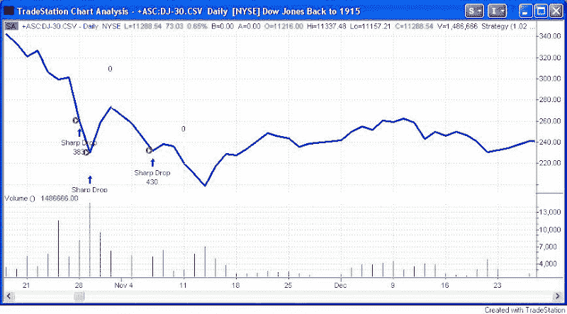
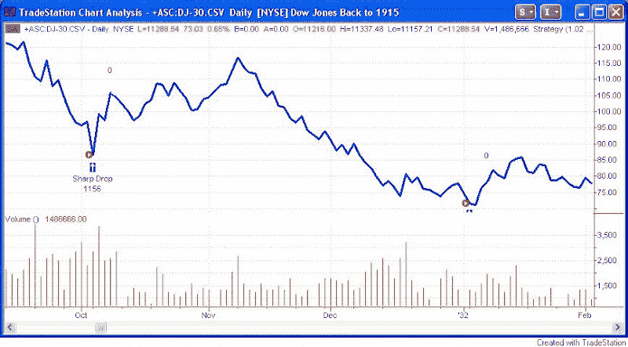
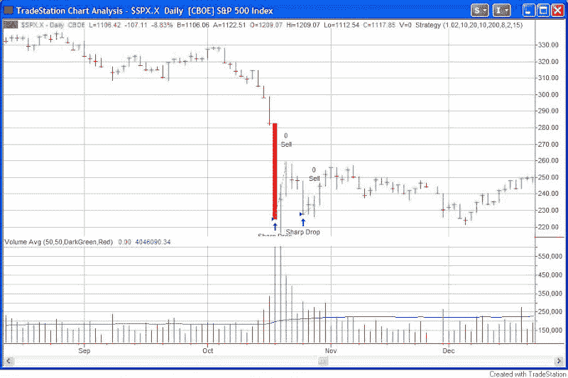

<!--yml
category: 未分类
date: 2024-05-18 13:37:41
-->

# Quantifiable Edges: The Crash Of 29...September 29

> 来源：[http://quantifiableedges.blogspot.com/2008/09/crash-of-29september-29.html#0001-01-01](http://quantifiableedges.blogspot.com/2008/09/crash-of-29september-29.html#0001-01-01)

The S&P 500 today lost 8.7%. That wasn’t the worst of it. The Nasdaq 100 lost about 10.5% and the banking index (BKX) lost 20%. For the S&P 500 there has only been 1 day that has been worse – 10/19/87 - the crash of ’87\. On October 26, 1987 the S&P dropped 8.3%, which was close. Some other memorable drops since then would include 10/27/97 (-6.9%), 8/31/98 (-6.8%), and 9/17/01 (-4.9%). This was about 2% worse than any of those.

Using the Dow, I was able to look at similar drops back to 1920\. Below are charts of all the times the Dow lost 8.0% or more in one day.

1929

1931-32

August 1932

1933

1987

A few observations:

1932 and 1987 were the only instances that were near a low.

In no case was a V-bottom like ’97, ’98, or ’01 formed. A sharp bounce was followed by either sideways or downward movement.

A sharp bounce occurred within 3 days in all cases.

1932 was the only time the day of the big drop came after an extended decline. In contrast, the crashes of 1929 and 1987 happened as a breakdown from a topping pattern.

Good luck trading.