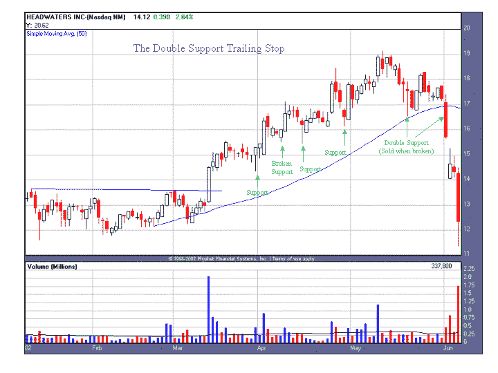

<!--yml
category: 未分类
date: 2024-05-18 08:34:34
-->

# Quantifiable Edges: The Double Support Trailing Stop

> 来源：[http://quantifiableedges.blogspot.com/2008/02/double-support-trailing-stop.html#0001-01-01](http://quantifiableedges.blogspot.com/2008/02/double-support-trailing-stop.html#0001-01-01)

Today saw some big swings but did little to change my moderately bullish bias. Rather than post a study tonight, I thought I’d change things up a bit.

In some comments on January 23rd, “Tim” mentioned he remembered an article I’d written a long time ago in which I discussed “double support stops”. (It was actually the first column I ever published). Since then I’ve seen a large number of readers have done searches on “Double Support Stop Rob Hanna” or something along those lines. Anyway, the column can’t be found anywhere anymore. But you want it – you got it. From way back in 2002 (along with a 2002 chart and ticker symbol - the ticker has since changed to HW if you want to pull it on your own software), I give you “The Double Support Trailing Stop”.

******The Double Support Trailing Stop**

*The Concept* Like most traders, I have a whole checklist of criteria that must be met before I will consider purchasing a stock. I spend a substantial amount of time researching potential candidates so that I may find a few stocks that meet my criteria. One of the most frustrating and difficult things for me is finding a great stock, buying it at the right time, and then being stopped out of it just before it reverses and goes on to huge gains. Having traded in multiple time frames over the years I have experienced this frustration with day, swing, and intermediate term trades. To keep myself in winning trades longer and avoid being shaken out early, I developed my “Double Support Trailing Stop Technique”. I will show an example of this technique on an intermediate term trade, but have successfully employed it in many different time frames, and originally created it for my day trades.

The idea is simple. If I require a large numbers of reasons to enter a trade, I should require more than just one reason to exit it if I want to catch as much of the move as possible. I will therefore require two levels of support to be broken before I will PERMANENTLY & COMPLETELY exit a trade. How you define support does not really matter. You can use pullbacks, consolidation lows (or highs), fibonacci’s, moving averages, trend lines, or whatever fits your trading style.

*An Example* Being that the below example is an intermediate term trade, I simply used consolidations & pullbacks, along with the 50 day moving average (shown as the rising blue line) for my support levels. I define a pullback to be any bar (or series of bars) with a lower low AND lower high after a stock has made new highs. The stock shown is Headwaters Inc (ticker: HDWR). I purchased this stock as it burst out of a flat base in the middle of March. My initial stop on the breakout would have been 8% from my purchase price, or the low of the base. After breaking out, it moved up sharply for 5 days before starting to pull back. It pulled back for seven days before reversing and moving higher. The low of this pullback is near the 1st green arrow labeled “Support”. It became support in my eyes after the stock move higher from there by making a higher high and higher low on the next bar. When that happened I was able to move my initial stop up to the breakout point. (I consider the high of a flat base or high tight flag to be a level of support also.)

Next, the stock moved up again for several days before making a second pullback down to the green arrow labeled “Broken Support”. The “Broken Support” bar was initially just the next area of support after the stock had pulled back and moved higher. When that happened, I was able to move my stop up under the 1st green support arrow. It became “broken” 5 days later when the next bar labeled “Support” moved below the low of “Broken Support”. If I had exited at the “broken support” level here, I would have been shaken out of the stock and missed the rest of the move. Instead, the stock continued to move up and create higher and higher support levels.

The time came for me to sell this stock at the area marked “Double Support (Sold When Broken)”. It was at this time that the stock moved below two levels of support. The first was the 50 Day Moving Average, and the second was the pullback low just above the “Double Support” green arrow. As you can see, this turned out to be a good time to take profits and exit this trade. Three days later it was trading nearly 30% lower.****

********

*****Additional Considerations* Earlier I used the term “permanently & completely exit”. Due to the fact that the 1st and 2nd levels of support may be very far away from each other in some instances, I may consider exiting the position partially, or exiting and then looking for an opportunity to re-enter the position, when it breaks the 1st level of support. The main reason I would do this is not to give back too much of my profits. Once two levels of support are broken, I want to be completely out of the position and will not consider re-entering without a whole new base setting up.

Since the “Double Support Trailing Stop” will keep you in positions longer, it is most effective when you are trading with the overall trend of the market. In other words, long positions in an uptrending market, and short positions in a downtrending market.****