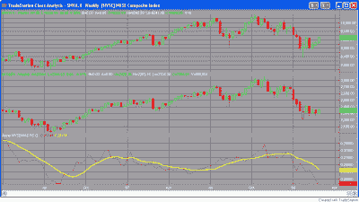

<!--yml
category: 未分类
date: 2024-05-18 08:33:02
-->

# Quantifiable Edges: The Intermediate Term Significance Of A Lagging Nasdaq

> 来源：[http://quantifiableedges.blogspot.com/2008/02/intermediate-term-significance-of.html#0001-01-01](http://quantifiableedges.blogspot.com/2008/02/intermediate-term-significance-of.html#0001-01-01)

One indicator I look at comes from Gerald Appel’s book

[“Technical Analysis – Power Tools For Active Investors”.](http://www.amazon.com/Technical-Analysis-Power-Active-Investors/dp/0131479024/ref=pd_bbs_sr_1?ie=UTF8&s=books&qid=1204128571&sr=8-1)

It is a relative strength measure of the NYSE vs. the Nasdaq looked at on a weekly chart. Without going into great detail, the premise behind the indicator is that the market tends to perform better when the appetite for Nasdaq stocks is greater than the appetite for NYSE stocks.

Part of this is due to the higher volatility of the Nasdaq, and part of it is due to investors willingness to speculate more aggressively when their outlook is positive. Whatever the reasons behind it, the indicator has been a pretty good barometer over the years. Mr. Appel suggests using a 10-week relative strength indicator to measure this phenomenon. This is what I’ve done in the chart below. The way the indicator works is as follows: When the red line is above the yellow line, the Nasdaq is leading the NYSE. When the red line is below the yellow line, the Nasdaq is lagging the NYSE. (Click to enlarge).

Since 1971, close to 100% of the market’s gains have occurred when the Nasdaq is leading rather than lagging. As you can see from the chart above, the Nasdaq has begun to lag badly. I decided to look and see how the market has performed under similar conditions in the past.

Using the NYSE composite as the “tradable” vehicle, I set up the following rules: 1) The NYSE must make a new 5-week high this week. 2) The current NYSE/Nasdaq ratio must be at least 3.0% below the 10-week EMA. (The red line must be 3.0% or more below the yellow line.) 3) The difference between the current NYSE/Nasdaq ratio and the 10-week EMA must be at it’s widest point in the last 5 weeks. (The red line must be farther below the yellow line than it has been in at least 5 weeks.)

If all three conditions are met, sell the market short on the close. Cover X weeks later. Results below:

As you can see, a Nasdaq lagging as badly as it is right now has been quite bearish historically. The bearish tendency carries through over a significant period of time as well (10 weeks.) If the Nasdaq could begin to assert a leadership role, that could help the current rally attempt greatly. If not, bulls better hope it’s different this time.