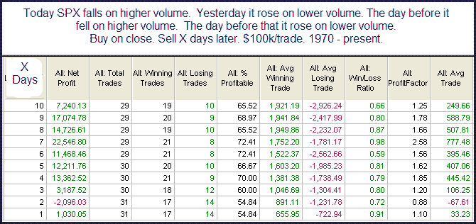

<!--yml
category: 未分类
date: 2024-05-18 13:11:52
-->

# Quantifiable Edges: The Last 4 Days Price/Volume Pattern

> 来源：[http://quantifiableedges.blogspot.com/2009/10/last-4-days-pricevolume-pattern.html#0001-01-01](http://quantifiableedges.blogspot.com/2009/10/last-4-days-pricevolume-pattern.html#0001-01-01)

Price/volume the last 4 days has done the following. Thursday the SPX closed at a 50-day high on lower NYSE volume. Friday SPX closed lower and NYSE volume rose. Monday we got another 50-day closing high on lower NYSE volume. Tuesday another market drop with rising volume. That certainly

*sounds*

like a bearish price/volume pattern. I took a look.

Going back to 1970 I was only able to find two other instances with the same 4 day pattern where 50-day highs were being made. The 1st was 3/26/81 and it was followed by a decline of nearly a year and a half. The 2nd instance was 6/6/95 and that was followed by a 3-day consolidation and then a continuation of a massive bull market. Nothing to learn there.

But what if we look at the 4-day price/volume pattern on its own and not require new highs be made? Based on common knowledge it would still

*seem*

to be bearish. Below are stats going back to 1970:

It could be argued that the above results suggest bullish tendencies, especially over the 4-7 day period. I don’t see any evidence that suggests the current 4-day price/volume pattern is bearish.