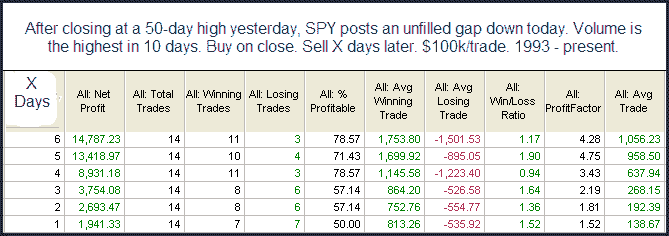

<!--yml
category: 未分类
date: 2024-05-18 13:07:03
-->

# Quantifiable Edges: The One Study I Saw With Bullish Implications

> 来源：[http://quantifiableedges.blogspot.com/2010/01/one-study-i-saw-with-bullish.html#0001-01-01](http://quantifiableedges.blogspot.com/2010/01/one-study-i-saw-with-bullish.html#0001-01-01)

Much of what I looked at last night suggested additional downside in the next few days. Below is a copy of the one study that showed short-term bullish tendencies.

{edit - should read highest volume

***in 5 days***

}