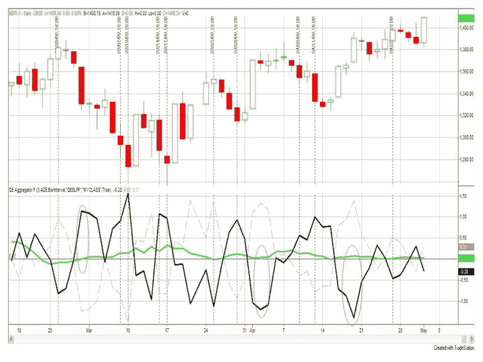

<!--yml
category: 未分类
date: 2024-05-18 08:13:01
-->

# Quantifiable Edges: The Quantifiable Edges Aggregator

> 来源：[http://quantifiableedges.blogspot.com/2008/07/quantifiable-edges-aggregator.html#0001-01-01](http://quantifiableedges.blogspot.com/2008/07/quantifiable-edges-aggregator.html#0001-01-01)

In both the

[nightly Subscriber Letter](http://www.quantifiableedges.com/letter.html)

and the

[Weekly Research Letter](http://www.quantifiableedges.com/weekly.html)

, I feature a chart in the short-term outlook section of the Quantifiable Edges Aggregator. Below is a write-up on the construction and use of the Aggregator.

In an effort to better illustrate what my studies are suggesting vs. what the market is doing, I developed the Quantifiable Edges Aggregator. To construct the QE Aggregator I first tally what the Quantifiable Edges studies are projecting. To do this I take each active study listed in the Quantifiable Edges Subscriber Letter and plug the gains and losses it projects over the next several days, weeks, or months into a spreadsheet. For each day I add up the projection of all studies and average them. This provides the projection for that day. Since the individual day can be highly variable, I use a 3-day average to determine the projections.

I then compare this with the behavior of the market vs. the studies over the past three days to see whether the market has been outperforming or underperforming expectations. Below is a chart with the indicator included for easier reference:

What’s being shown:

Candlesticks in the top section of the chart are daily bars of the S&P 500.

The bottom section contains the QE Aggregator. There are several lines here to look at:

1) The brown horizontal line is at “0”.

2) The dotted grey line is simply the 3-day moving average return of the S&P 500 in percent terms. If it was up over the last 3 days this will be above the brown line, if it was down it will be below the brown line.

3) The green line is the projected return of the studies for the NEXT 3 days. (The Aggregator.)

4) The thick black line is the difference between the QE Aggregator’s value from 3 days ago and the S&P’s return over the last 3 days (Green line value from 3 days ago – today’s grey line value = black line.) Its value represents whether the market has outperformed or underperformed the Aggregator’s expectations over the last three days. If the black line is above 0 that means the S&P has been underperforming expectations. If the black line is below 0 then the S&P has outperformed expectations over the last three days.

What should we look for to help identify opportunities?

The Aggregator on its own is of some value, but the real opportunities arise under two scenarios:

1) The S&P has underperformed expectations over the last few days and the Aggregator is showing a positive expectation for the next few days. Instances where this occurs are marked with a purple dashed vertical line. You are basically looking for times when both the green line (Aggregator) and the black line are stretched above the “0” line. The higher the stretch the better. These represent long opportunities.

2) The S&P has outperformed expectations over the last few days and the Aggregator is showing a negative expectation for the next few days. Instances where this occurs are marked with a red-dashed vertical line. You are basically looking for times when both the green line and the black line are stretched below the “0” line. The lower the stretch the better. These represent short opportunities.

Several of these “signals” line up with actual long and short trade ideas I put into the Subscriber Letter. These would include the 2/26 short, 3/7 and 3/10 longs, the 3/25 short (which went unfilled in the Letter), and the 3/28 long. By quantifying and visualizing the studies in this way it may make it easier to identify opportunities.

The orange circled areas are the last ones to discuss. The first one near the end of Feb shows a point when then S&P had largely underperformed the Aggregator but the Aggregator was still suggesting lower prices over the next few days. The two circled areas in April represent times when the market had largely outperformed over the past few days but the Aggregator was suggesting a positive bias. In all such cases this generally led to a few days of choppy trading.