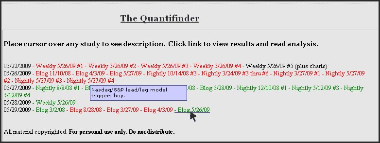

<!--yml
category: 未分类
date: 2024-05-18 13:20:30
-->

# Quantifiable Edges: The Quantifinder Unveiled

> 来源：[http://quantifiableedges.blogspot.com/2009/05/quantifinder-unveiled.html#0001-01-01](http://quantifiableedges.blogspot.com/2009/05/quantifinder-unveiled.html#0001-01-01)

Have you ever found an edge I’ve discussed on the blog to be helpful, but wished you could be notified to next time it set up? For example

[on February 25, 2008](http://quantifiableedges.blogspot.com/2008/02/surge-leads-to-breakout-is-that-good.html)

I showed how the S&P has performed following 2 consecutive days where it has risen 0.75% or more. The results were quite bearish over the next 1-10 days. Most traders may have seen that and factored it in to their thinking at the time and then forgotten about it.

Those who instead incorporated it into their bag of tricks benefitted greatly.

[On March 27, 2009 I did another post](http://quantifiableedges.blogspot.com/2009/03/two-strong-up-days-under-200-revisted.html)

which updated the results of the 1st study. It also showed how the setup had performed since 2008 study was published. Being aware of when the setup is occurring can benefit traders in numerous ways. You could use it to enter short positions, or exit longs, or tighten stops, or adjust position sizes, or whatever suits your trading style.

The problem has been that tracking so many edges can be an arduous task. Not anymore. Now being aware of Quantifiable Edges studies is as easy as pulling up a web page.

It’s Quantifiable Edges quantum leap in quantitative research…the Quantifinder!

The Quantifinder is designed to automatically search through Quantifiable Edges database of published research and extract anything that is applicable to the current day's market action. This includes studies based on price, breadth, volume, leadership, and sector rotation. It looks at both daily and weekly data across a wide range of indices. All applicable studies are then published on the Quantifinder page, where you can easily see their bullish/bearish tendencies and a description of the research. From there it is just a click on the study and the publication (blog, Subscriber Letter, or Weekly Research Letter) is automatically pulled up. This allows you to read what I've written about similar setups in the past. A screenshot of the Quantifinder is below.

Detailed information on the

[Quantifinder can be found here](http://www.quantifiableedges.com/quantifinderinfo.html)

.

There are 2 versions of the Quantifinder.  The intraday version notifies

[Gold](http://www.quantifiableedges.com/gold.html)

subscribers of potential edges as the market close is approaching. Then the end-of-day version shows what studies actually did trigger.

If you’d like to trial Quantifiable Edges and the new Quantifinder, then you may sign up for

[a free 1-week trial here](http://www.quantifiableedges.com/members/register.php)

.

So perhaps you’re wondering why I used the above study as an example? You’ll notice the Quantifinder is showing it has now set up again as of Friday’s close - “Blog 3/27/09” showing up in red (meaning bearish).