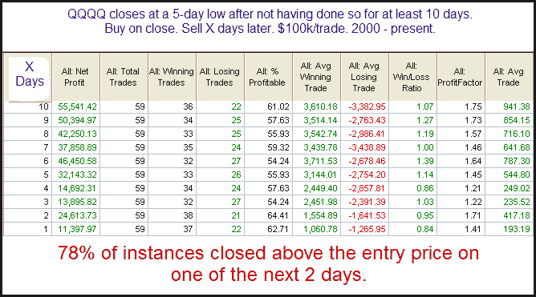

<!--yml
category: 未分类
date: 2024-05-18 13:04:23
-->

# Quantifiable Edges: This Former Study Is Suggesting QQQQ May Soon Bounce

> 来源：[http://quantifiableedges.blogspot.com/2010/02/this-former-study-is-suggesting-qqqq.html#0001-01-01](http://quantifiableedges.blogspot.com/2010/02/this-former-study-is-suggesting-qqqq.html#0001-01-01)

In examining Tuesday’s action

[the Quantifinder](http://quantifiableedges.blogspot.com/2009/05/quantifinder-unveiled.html)

spotted an interesting study from the 8/7/09 Blog that looks at QQQQ. I’ve updated the results below:

To me this appears to be a decent though not overwhelming edge that sees a good portion of the bullish tendency play out in the 1st two days.