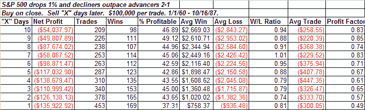
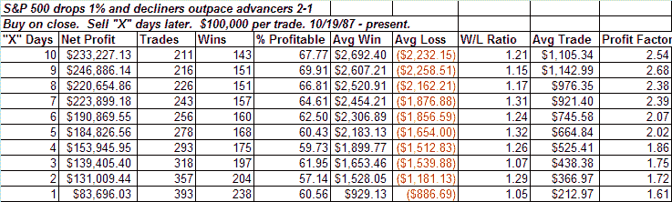
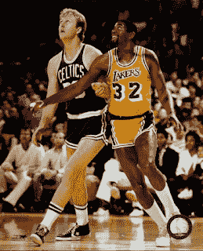

<!--yml
category: 未分类
date: 2024-05-18 08:15:44
-->

# Quantifiable Edges: This Setup's Been Favorable Since The Last Time They Met In The Finals

> 来源：[http://quantifiableedges.blogspot.com/2008/06/this-setups-been-favorable-since-last.html#0001-01-01](http://quantifiableedges.blogspot.com/2008/06/this-setups-been-favorable-since-last.html#0001-01-01)

The market sold off fairly hard on Monday with decliners swamping advancers by more than 2 to 1\. Volume was light, though.

I ran a test to see how the S&P has reacted following a day when it was down at least 1% on 2:1 or higher declining breadth. What was most interesting about this test is that results were significantly different in the last 21 years than they were before that. From 1960 up until the Crash of ’87 the results were as follows:

From the Crash of ’87 until today they look like this.

Buying and holding for a week after such a day would have been a winning strategy every year since 1987 except in 2006\. Prior to that – consistent loser. In case you're wondering, using lower volume as a filter improved results slightly.

I’m not sure why the change. Perhaps the Crash changed the psyche of the market. Traders may have decided if it could bounced back from that, it could bounce back from anything – and so dip buying became fashionable and profitable.

Whatever the reason, since 1987 days like Monday have fairly consistently provided an upside edge over the next couple of weeks.

And speaking of 1987…they’re baaaaack!

