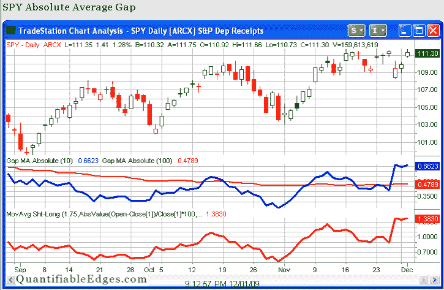
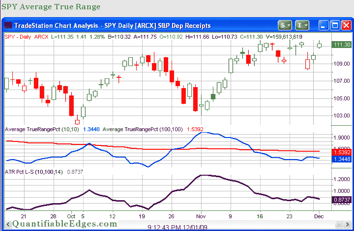

<!--yml
category: 未分类
date: 2024-05-18 13:09:20
-->

# Quantifiable Edges: Thoughts On Recent Gap Activity

> 来源：[http://quantifiableedges.blogspot.com/2009/12/thoughts-on-recent-gap-activity.html#0001-01-01](http://quantifiableedges.blogspot.com/2009/12/thoughts-on-recent-gap-activity.html#0001-01-01)

A trader I know pointed out the unusually large gap activity lately. I track the 10-day absolute average gap over the 100-day absolute average gap on the charts page in the members section of the site. Meanwhile I observed the average true range is still below normal. I’ve copied the two charts from the website to illustrate.

The real odd behavior here is with the average gap size. Such gappy behavior is unusual with the market near new highs. It’s also unusual when there isn’t also a substantial increase in the intraday range. I looked at this a number of different ways last night. The 10/100 Absolute Avg Gap is 1.38 (meaning the 10ma is 38% larger than the 100ma of the overnight gap size). I looked at other instances where similar levels were approached and the market was near a new high. It’s been fairly unusual over the last 15 years and results were inconclusive.

I then look at comparing the size of the average gap to the size of the average intraday range (not the true range as shown above). Here again I found we are at very high levels but past history was choppy and inconclusive.

Lastly I looked at times where the 10-day average gap was well above normal and the 10-day average intraday range was well below normal. Again I could find nothing suggesting a significant directional edge.

So is this activity suggestive of anything? Perhaps. While the readings themselves don’t seem to help greatly in predicting direction, they do indicate some unusual behavior. My take is that the market is being influenced more by outside forces than is customary. It’s been noted by many that the dollar has been leading everything by the nose lately. Outside influences like Dubai debt have also had an overnight influence lately. This would seem to explain why such a large percentage of action is occurring overnight.

So what should we do about it as traders? Two things come to mind – 1) Be more cognizant of dollar and other intramarket action. 2) Perhaps don’t put quite as much weight on standard price, volume and breadth indicators as usual. The studies have done quite well as of late. Still, it may be worth trading with a bit more caution than usual until the stock market manages to decouple from the dollar a little bit.