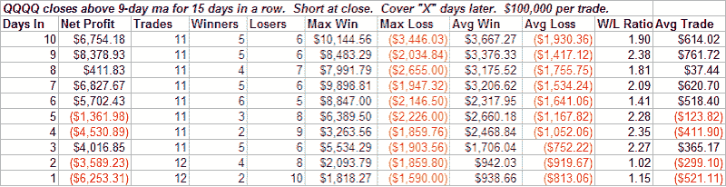

<!--yml
category: 未分类
date: 2024-05-18 08:18:01
-->

# Quantifiable Edges: Time Stretches

> 来源：[http://quantifiableedges.blogspot.com/2008/05/time-stretches.html#0001-01-01](http://quantifiableedges.blogspot.com/2008/05/time-stretches.html#0001-01-01)

Chris over at

[Smallcap Slingshot](http://smallcapslingshot.blogspot.com/)

made an observation Wednesday night that the QQQQ hadn’t closed below its 9-day moving average for 15 days. He was curious to see if spending so long on one side of a short-term moving average provided any edge. First I’ll show a test based on his observation then I’ll give my thoughts on this kind of action.

The table below shows the results of shorting anytime the QQQQ closes above it’s 9-day moving average for 15 days in a row, and then holding for “X” number of days. The data goes back to 1999.

As you can see, the results are somewhat choppy.

If instead of holding for a specified number of days, you sell when the QQQQ closes below its 9-day moving average, then your results will improve slightly. Here are the results for QQQQ with this exit strategy:

Trades – 11

Winners – 7

Avg win – 1.8%

Avg Loss – 1.5%

Avg Trade – 0.6%

Profit Factor – 2.1

Not bad, but the low number of trades makes it questionable. Running the same test on the S&P 500 for the last 25 years produces the following results:

Trades – 52

Winners – 31

%Profitable – 59.6%

Avg Win – 0.9%

Avg Loss – 1.0%

Avg Trade – 0.13%

Profit Factor – 1.3

Throw in some commissions and slippage and the positive expectancy of 0.13% is likely close to or at a negative number. On its own, just being above or below a moving average for an extended period provides only a small edge.

Does that mean the ideas should be scrapped? No. In fact, Chris is on to something and his observation is a keen one. Combine a few small edges and you may end up with a substantial one. Some kind of action to trigger an entry when the market is in this extended condition could work quite well.

I’ve referred to these extended periods above or below moving averages in the past as “time stretches”.

[In January I showed a time stretch technique](http://quantifiableedges.blogspot.com/2008/01/time-cbi-indicate-bounce-could-be-near.html)

which worked well in timing the bottom. In that case it was a simple time stretch below a moving average while posting a new closing low. In an upcoming post I may show an example of a time stretch technique from the

[Quantifiable Edges Subscriber Letter](http://www.quantifiableedges.com/letter.html)

.