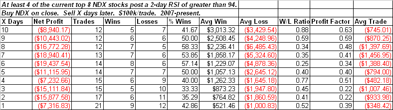

<!--yml
category: 未分类
date: 2024-05-18 13:19:53
-->

# Quantifiable Edges: Top Weighted Nasdaq 100 Components Very Overbought

> 来源：[http://quantifiableedges.blogspot.com/2009/06/top-weighted-nasdaq-100-components-very.html#0001-01-01](http://quantifiableedges.blogspot.com/2009/06/top-weighted-nasdaq-100-components-very.html#0001-01-01)

I noted in Thursday night’s Subscriber Letter that AAPL and GOOG had both risen for 8 days in a row. Additionally, those two along with MSFT and ORCL all had 2-day RSI’s of over 98\. That’s an extremely overbought level. These 4 stocks are among the top 7 and make up about 26% of the Nasdaq 100\. Using the list of current Nasdaq 100 stocks I studied action among the current 8 highest weighted. In addition to the 4 above this includes RIMM, QCOM, CSCO and GILD. I looked at other times since 2007 that at least 4 of these 8 stocks closed with a 2-day RSI in excess of 94\. Those results are below:

It’s not exactly a layup that a pullback should immediately begin. Still, risk appears to greatly outweigh reward when several of the top components are strongly overbought short-term. A brief look at the W/L Ratio suggests this. A pullback does normally come at some point in the next few days though. In fact of the 21 instances where the conditions were met, only one did not experience a close below the trigger day’s close within the next 4 days.