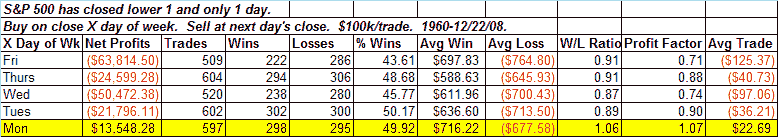
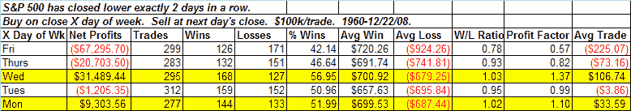
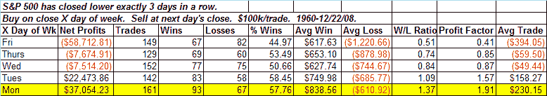
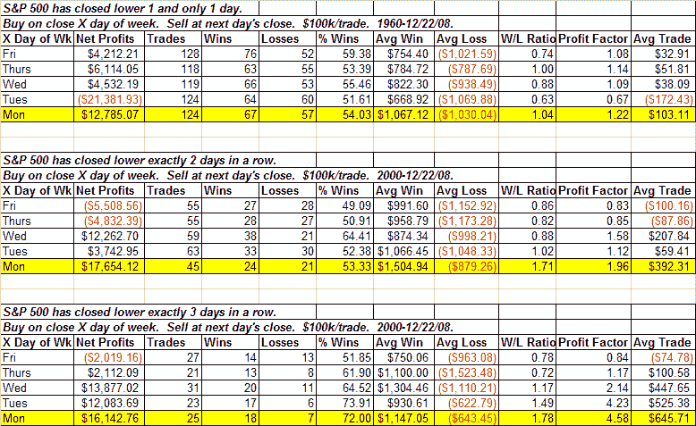

<!--yml
category: 未分类
date: 2024-05-18 13:29:55
-->

# Quantifiable Edges: Turnaround Tuesdays

> 来源：[http://quantifiableedges.blogspot.com/2009/01/turnaround-tuesdays.html#0001-01-01](http://quantifiableedges.blogspot.com/2009/01/turnaround-tuesdays.html#0001-01-01)

Many traders have heard the term “Turnaround Tuesday”. And with the market a bit short-term oversold after the selloff the last few days many traders are also hoping we see a Turnaround Tuesday. But are they just a myth? I recently put them to the test.

First I looked at performance if the market closed lower 1 day. In the table below I show all the days of the week. The day listed is the trigger day – not the performance day. In other words, if Monday was the 1st down day then the S&P would be bought at the close and sold at Tuesday’s close. So the Monday trigger tracks Tuesday’s performance. Tuesday’s trigger tracks Wednesday’s performance…and so on.

Here we see going back to 1960 that Tuesday had the only positive results of the week.

What if the market was down 2 days (as it is now) instead of just one?

Tuesday is again positive, but in this case Thursday has actually performed a little better.

How about 3 days in a row?

Here again Tuesday is the star of the week.

But these tests all went back to 1960\. What if we instead just look at more recent times? Below I show results for just this decade:

In all cases Tuesday shows by far the best potential for a turnaround. The results are even better recently than if you look back 58 years. It appears Turnaround Tuesdays are real…and they’re not just for old folks.