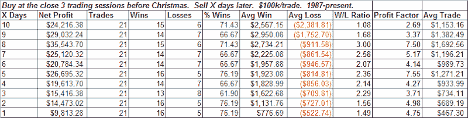

<!--yml
category: 未分类
date: 2024-05-18 13:31:22
-->

# Quantifiable Edges: Twas 3 Nights Before Christmas

> 来源：[http://quantifiableedges.blogspot.com/2008/12/twas-3-nights-before-christmas.html#0001-01-01](http://quantifiableedges.blogspot.com/2008/12/twas-3-nights-before-christmas.html#0001-01-01)

With only two trading sessions left until Christmas, we are now in a seasonally strong period for the market.

Below is a breakdown of the last 21 years and how the S&P has performed from this point forward.

The next 1 to 5 days have been especially bullish.

If you decided to buy the close 3 sessions before Christmas and then sell the 1

^(st)

profitable close after entry then 18 of 21 trades would have been winners within 2 days and 20 of 21 within 5 days.