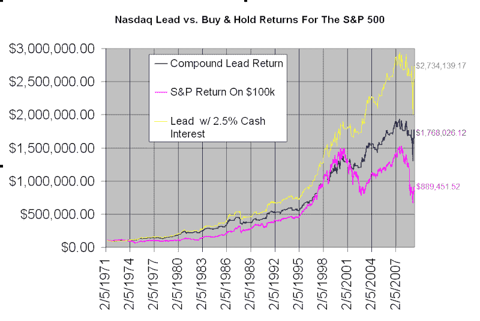
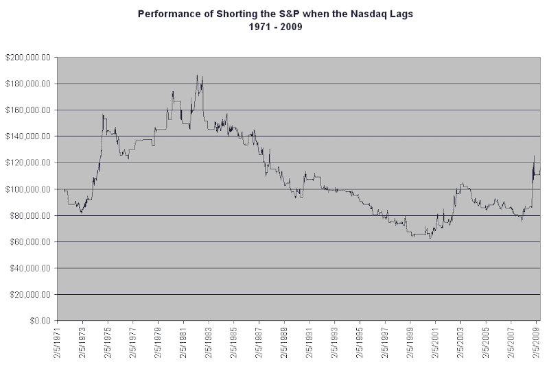

<!--yml
category: 未分类
date: 2024-05-18 13:20:17
-->

# Quantifiable Edges: Tweaking The Nasdaq/S&P Lead/Lag Model

> 来源：[http://quantifiableedges.blogspot.com/2009/06/tweaking-nasdaqs-leadlag-model.html#0001-01-01](http://quantifiableedges.blogspot.com/2009/06/tweaking-nasdaqs-leadlag-model.html#0001-01-01)

Last week I discussed an indicator designed by Gerald Appel and published in his book

[“Technical Analysis – Power Tools for Active Investors”.](http://www.amazon.com/Technical-Analysis-Power-Active-Investors/dp/0131479024)

He refers to it as the Nasdaq/NYSE Relative Strength Indicator (not to be confused with RSI). I changed it slightly for my purposes and instead of tracking the Nasdaq vs. the NYSE, I instead tracked the Nasdaq vs. the S&P 500\.

[In last week’s post](http://quantifiableedges.blogspot.com/2009/05/simple-powerful-timing-indicator.html)

I demonstrated that the S&P had performed much better over time when the Nasdaq was in a leading position.

I also provided a spreadsheet with the calculation and a model based on the indicator on the free downloads section of the website.

When conducting research or designing models it’s important to avoid just looking at it from one angle. Today I’m going to explore a couple of other ideas that the indicator / model may have invoked in many of you. I’ve also updated the spreadsheet so that you can see how these ideas were tested as well.

First, a quick refresher chart of last week’s results.

As you can see, utilizing the indicator would have greatly enhanced your returns over time. So if owning the S&P when the Nasdaq is leading is so favorable, does that mean you should short the S&P when the Nasdaq is lagging?

Below is an equity curve of a $100,000 investment doing exactly that. (Interest and dividends are not included.)

After almost 40 years the current (recent?) bear market just got you back into the black. Certainly this isn’t an equity curve that suggests an edge. While some may be surprised based on how positive the previous results were, it makes complete sense. The strategy in this chart calls for shorting the leading index. I don’t believe I’ve ever seen anyone who has suggested that to be a good idea.

But what if instead of buying the S&P when the Nasdaq leads, we buy the Nasdaq? It is the leader after all.

Equity chart below. Hold on to your hats.

Like the original test, dividends are not included. The annual growth rate if you earn 2.5% interest on your cash balance is about 13%. This is more than twice the S&P 500 annual growth rate of under 6% for the period. There’s also lower drawdown and you’d only be in the market a little more than half the time.

Last week we saw how timing the market with this simple indicator can make a big difference. Here you see that a small tweak to ensure you’re in the leading index can juice returns much, much more. There are numerous other tweaks you could add to the model to improve performance or reduce drawdowns further. This is as far as I’m going to take it, though. The spreadsheet is still available and updated with the above tests and charts. You may download the updated version

[on the free downloads page](http://www.quantifiableedges.com/members/freedownload.php)

. I’d suggest anyone who downloads it should use it as a starting point – not a finished product.

For more ideas on using Excel for historical analysis I’d recommend buying

[Dr. Steenbarger’s Daily Trading Coach book](http://www.amazon.com/s?ie=UTF8&search-type=ss&index=books&field-author=Brett%20N.%20Steenbarger&page=1)

. A few weeks ago I created a sample spreadsheet based on the lessons in that book. You may download that spreadsheet

[on the free download page](http://www.quantifiableedges.com/members/freedownload.php)

as well. Registration is required for the Nasdaq/S&P Lead/Lag Model. Registration is NOT required for the Daily Trading Coach Spreadsheet.