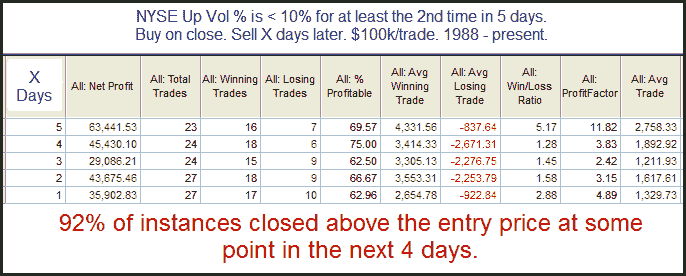

<!--yml
category: 未分类
date: 2024-05-18 12:58:04
-->

# Quantifiable Edges: Two 90% Down Days In One Week

> 来源：[http://quantifiableedges.blogspot.com/2010/06/two-90-down-days-in-one-week.html#0001-01-01](http://quantifiableedges.blogspot.com/2010/06/two-90-down-days-in-one-week.html#0001-01-01)

It was just a little over a week ago that I was examining what occurs after the market posts 2 90% Up Days in a 1-week period. The results appeared quite bullish. Thursday we saw the 2nd 90% down day in the last 3 days. I stretched the requirement out to 1 week and took a look.

For the short-term at least, such negative breadth appears to suggest a bounce.