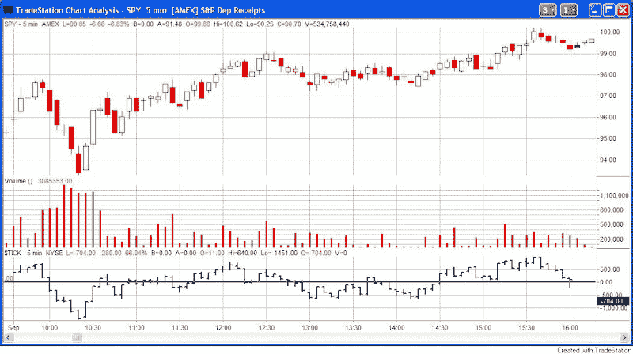

<!--yml
category: 未分类
date: 2024-05-18 13:36:35
-->

# Quantifiable Edges: Two Possible Outcomes

> 来源：[http://quantifiableedges.blogspot.com/2008/10/two-possible-outcomes.html#0001-01-01](http://quantifiableedges.blogspot.com/2008/10/two-possible-outcomes.html#0001-01-01)

It seems the market is getting ready to either:

a) Complete this capitulation and reverse upwards very hard, or

b) Drop to zero and close its doors for good.

At this point I wouldn’t rule out either one. If you’re of the belief that it is more likely to reverse hard than go to zero then you’re probably in the minority. You may also find the following charts interesting. They’re 5-minute charts of the legendary reversal bottoms. Whether you’re long, short, or sidelined you may want to study them for a few minutes – in case it doesn’t drop to 0.

September 1, 1998

July 24, 2002

October 10, 2002

They didn't all happen in 1 day. Here's 3/12 and 3/13/2003.

One common theme I see is that once the bottom was established the uptrend stayed in tact. October 10th 2002 saw a brief and relatively minor break of price support just before noon. Other than that all the rallies held their ground throughout the day. In other words, if you're trading intraday, a loose trailing stop may not be a bad idea. A sharp break of support seems unlikely if the market is going to put in it's next legendary reversal.