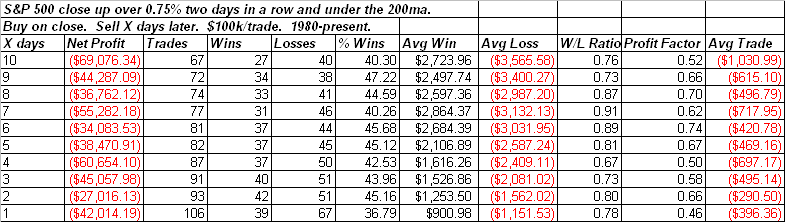

<!--yml
category: 未分类
date: 2024-05-18 13:24:45
-->

# Quantifiable Edges: Two Strong Up Days Under The 200 Revisted

> 来源：[http://quantifiableedges.blogspot.com/2009/03/two-strong-up-days-under-200-revisted.html#0001-01-01](http://quantifiableedges.blogspot.com/2009/03/two-strong-up-days-under-200-revisted.html#0001-01-01)

For the 2nd day in a row the market finished up strongly on Thursday. Over a year ago on the blog I posted a simple study that looked at S&P performance following

[two consecutive days where it rose at least 0.75%](http://quantifiableedges.blogspot.com/2008/02/surge-leads-to-breakout-is-that-good.html)

and closed below the 200ma. At the time the 0.75% hurdle was a good sized 1-day move. In the last year a move of that magnitude hasn’t been significant. Still, I thought it would be interesting to go back and run the results again using the same parameters.

These results are similar to the ones I showed last year. In fact the negative influence is now even more pronounced. To see how poorly the market has performed under these conditions in the last year I re-ran the test to show just the time period since the original blog piece:

The fact that the 0.75% hurdle has become easier to achieve hasn’t weakened the bearish influence of the setup. I attribute a large part of reason for this to be the

[exceptionally choppy environment](http://quantifiableedges.blogspot.com/search/label/Trend%20Vs.%20Chop)

the market has been in over the time period.