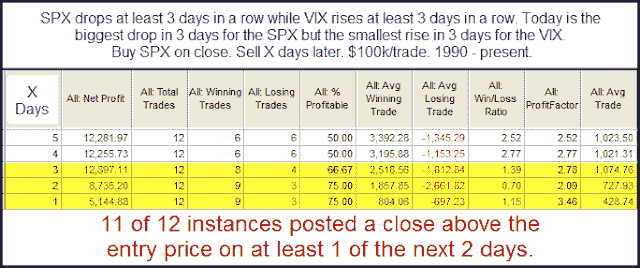

<!--yml
category: 未分类
date: 2024-05-18 08:58:46
-->

# Quantifiable Edges: Unusual Action on the 3-day Pullback

> 来源：[http://quantifiableedges.blogspot.com/2011/05/unusual-action-on-3-day-pullback.html#0001-01-01](http://quantifiableedges.blogspot.com/2011/05/unusual-action-on-3-day-pullback.html#0001-01-01)

A 3-day pullback on its own doesn't provide much of an upside edge. An edge tends to appear when the pullback happens in conjunction with other things. “Other things” might include a very low 3/10 Offset HV, a deceleration in the pullback, or a seasonal advantage. None of those things are appearing right now. But I did note one interesting aspect of this pullback that seemed worth further examination. While the SPX has declined the last three days, the VIX has risen the last three days. This isn't unusual. What is unusual is the fact that Wednesday's drop was the biggest for the SPX, yet the rise in the VIX was the smallest of the last 3 days. I looked at other times this had occurred since 1990.

Not a whole lot of instances but early indications are that the setup may be bullish.  I examined the instances a bit further in last night's subscriber letter.  I tossed around whether to incorporate these results into my estimates. Ultimately I decided not to. The results were very variable, the number of instances was low, and the last time it occurred was 2003. I did find it compelling enough to monitor going forward, though.