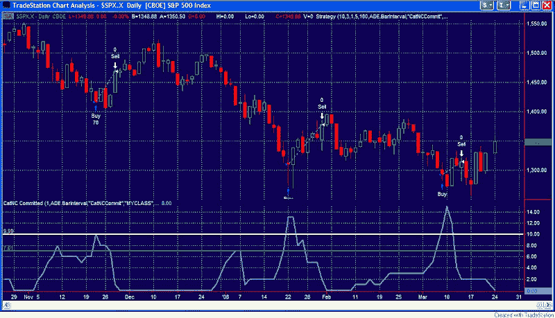

<!--yml
category: 未分类
date: 2024-05-18 08:30:28
-->

# Quantifiable Edges: Updated CBI Chart

> 来源：[http://quantifiableedges.blogspot.com/2008/03/updated-cbi-chart.html#0001-01-01](http://quantifiableedges.blogspot.com/2008/03/updated-cbi-chart.html#0001-01-01)

The

[Capitulative Breadth Indicator (CBI)](http://quantifiableedges.blogspot.com/search/label/CBI)

returned to “zero” yesterday, finally closing out the last of the recent trade cluster. Below is an updated chart of the index. The “buy” and “sell” arrows on the chart once again show the results if one was to buy the S&P any time the CBI hit 10 and then sell it when it closed at 3 or below. I’ve discussed this crude market timing system

[in the past](http://quantifiableedges.blogspot.com/2008/01/my-capitulative-breadth-indicator.html)

. Since 1995 it would now have proved profitable in 18 out of 18 trades – most of which occurred during “scary” selloffs.

For those interested in tracking the trades behind the CBI real time, they are provided to subscribers in the

[Quantifiable Edges Subscriber Letter](http://quantifiableedges.googlepages.com/home)

. Also in the Letter is CBI percentages of 24 different market sectors.