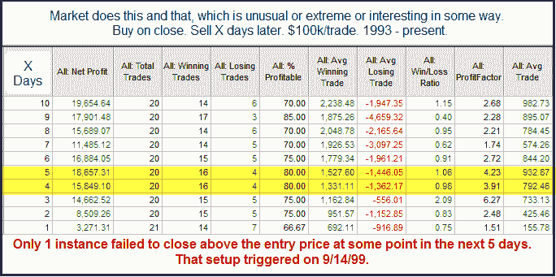

<!--yml
category: 未分类
date: 2024-05-18 09:02:55
-->

# Quantifiable Edges: Using Quantifiable Edges to Your Advantage - Part 1 - Understanding the Study Layout

> 来源：[http://quantifiableedges.blogspot.com/2010/11/using-quantifiable-edges-to-your.html#0001-01-01](http://quantifiableedges.blogspot.com/2010/11/using-quantifiable-edges-to-your.html#0001-01-01)

This post is the beginning in a series which will provide readers some ideas on how they can take some of the edges they see here (and elsewhere) and use them to their advantage in their own trading.

Before getting into a theoretical discussion it’s important that I make sure everyone understands what it is I’m presenting when I show these studies in the blog and the Subscriber Letter. Over time I have pretty much standardized the statistics that I show in my tables. I have tried to strike a balance between giving enough information to make the table useful and giving too much information which could make it messy and confusing. Below is a sample study (with real results but a bogus description). I’ll use this as an example to refer to.

The top box of the study always lays out the conditions. Everything that was taken into account is described there. One thing to note is that I always run the studies on $100k/trade. This is because most of them look at the S&P 500\. Since it trades at about 1,200 there will always be some leftover when buying into a portfolio (you can’t buy a half a share in Tradestation). The $100k makes the rounding error small enough so that it doesn’t have much of an affect. $10,000 would have too large of a rounding error. $1,000,000 would be better but then the numbers get so large it makes it more difficult to read.

With an even $100k I find the results easy to interpret. $1000 = 1% in the results columns. So in the above example the “Average Trade” shows a gain of $733 after 3 days. This is almost 0.75%.

Now let’s briefly review each column in the results table.

“X Days” – Most tests I run out over a number of days to see how the market has performed after the test conditions were in place. “X Days” just shows the length of time from the entry. The entry is normally assumed to take place at the close. The exits are also assumed to be at the close. The number of days refers to trading days – not calendar days. Note this column reads from the bottom up, which means all columns do. No reason for that. It’s just how I started doing it a long time ago.

“Net Profit” – This is the net gain or loss for the entire sample of instances included in the study. One thing to note is that I always “Buy” the setup. This is not because I am only looking for long edges. It is because it makes the table easier to read. A quick glance can tell me if the edge is bullish or bearish. Lots of positive, green numbers is bullish. Lots of negative, red numbers is bearish. A long time ago I would sometimes set the entry condition to “short” at the close. Then I could see profits from shorting. Doing this required me to read the entry conditions carefully and would occasionally lead to some confusion when I didn’t. So for purposes of easily reading the study tables, everything assumes a long position.

“Total Trades” – This is the total number of instances that triggered based on the study conditions. As in the case above, this number will sometimes be larger for Day 1 and then you’ll see a declining number of instances as you look further out. If you’re wondering why this happens, check out the June 18, 2010 blog post.

“Winning Trades” – The total number of trades that were showing a gain “X Days” later.

“Losing Trades” – The total number of trades showing a loss “X Days” later. The wining plus the losing trades typically add up to the total trades. In those rare instances when it doesn’t it means a trade was breakeven on that day.

“% Profitable” – This column simply shows the winners / total trades. Sometimes a 50% profitable situation can still show a strong edge. That would mean gains outsized losses by a large degree (or vice-versa). % profitable is important from a trading standpoint though. If a setup is 90% profitable it is generally less likely to put you through an extended drawdown as a setup that is 55% profitable with the same size average trade.

“Avg Winning Trade” – This looks at all the “winning trades” and divides them by the gross profits on those trades. (Gross gain and gross loss columns are not shown.) So in the table above, the “Avg Winning Trade” was up $692 after day 1\. This means that of the 14 instances that finished higher the next day, the average gained just under 0.7%.

“Avg Losing Trade” – Just like “Avg Winning Trade”, but it is looking just at the losers. In this case after day 1, the 7 losers dropped about 0.9% on average.

“Win/Loss Ratio” – This takes the value from the “Avg Winning Trade” column and divides by the value from the “Avg Losing Trade” column. It can help you determine whether the reaction was typically more explosive on moves up or down.

“Profit Factor” – This is the stat I am asked about the most. It is a stat often cited by system traders. Profit Factor = Gross Gains / Gross Losses. Profit factors above 1 occur when there are positive net results and below 1 occurs when there are negative net results from a study. When thinking about the importance of profit factor, it is easiest to consider how 2 systems may compare. Consider 2 systems made a hypothetical $10,000 each over a specified time period. System 1 had $15,000 in gains and $5,000 in losses. Its profit factor was 3\. (15k/5k = 3). System 2 also made $10,000 but it was on $100,000 in gains and $90,000 in losses. Its profit factor was 1.11 (100/90). Most people would find system 1 more appealing as it seemed to make the $10,000 with less effort and risk.

“Avg Trade” – This is simply the net gains divided by the total trades. Under most circumstances, I’ll use the information in this column to help generate estimates.

Last but not least I will often place a statement with additional information in a box below the results. This is typically information that can’t be seen in the table. A common bit of information I put here is how often the market might close up (or down) from the entry price at some point in the next few days.

In the next installment of this series I’ll give a brief discussion of attributes that would make a study compelling to me and entice me to incorporate it in formulating my market bias.