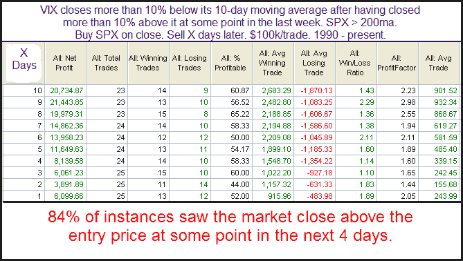

<!--yml
category: 未分类
date: 2024-05-18 13:10:17
-->

# Quantifiable Edges: VIX Goes From Overbought To Oversold In 5 Days

> 来源：[http://quantifiableedges.blogspot.com/2009/11/vix-goes-from-overbought-to-oversold-in.html#0001-01-01](http://quantifiableedges.blogspot.com/2009/11/vix-goes-from-overbought-to-oversold-in.html#0001-01-01)

The VIX has moved from overbought to oversold quite quickly this past week (based on its stretch above and below the 10-day average). This brings up the question of whether the now “oversold” VIX is suggesting a selloff for the S&P. I took a look at similar past situations.

Results have been inconsistent but risk/reward has generally favored more upside over the coming weeks. This would seem to make sense since what you’re typically looking at in the SPX with the above setup is a strong rebound from a sharp decline during a long-term uptrend.

I am seeing some signs the market is nearing a pullback. The VIX action is not one of those signs.