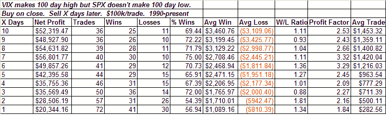

<!--yml
category: 未分类
date: 2024-05-18 13:36:04
-->

# Quantifiable Edges: VIX New Highs Without SPX New Lows

> 来源：[http://quantifiableedges.blogspot.com/2008/10/vix-new-highs-without-spx-new-lows.html#0001-01-01](http://quantifiableedges.blogspot.com/2008/10/vix-new-highs-without-spx-new-lows.html#0001-01-01)

The VIX put in a huge spike yesterday to another new high. The SPX manage to hold above its recent low before rebounding. Below I looked at long-term VIX spikes that were not accompanied by long term SPX lows and performance moving forward:

In the past there this particular setup has provided traders an upside edge.