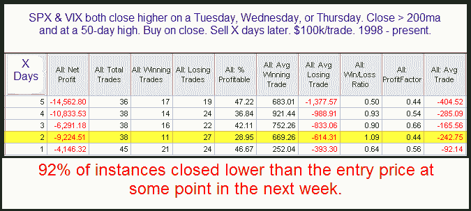

<!--yml
category: 未分类
date: 2024-05-18 13:10:04
-->

# Quantifiable Edges: VIX Rises As SPX Hits New High

> 来源：[http://quantifiableedges.blogspot.com/2009/11/vix-rises-as-spx-hits-new-high.html#0001-01-01](http://quantifiableedges.blogspot.com/2009/11/vix-rises-as-spx-hits-new-high.html#0001-01-01)

In a somewhat unusual move, while the SPX was closing at a 50-day high yesterday, the VIX actually closed higher. Below is a look at other times this has happened during the middle of the week.

These stats suggest a downside edge. Apparently the VIX should not be on the rise when the SPX is hitting new highs. The fact that it rose Wednesday implies a short-term pullback.