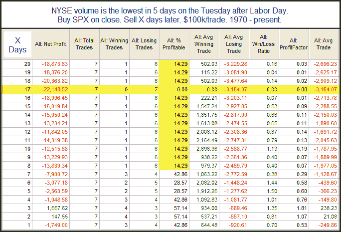

<!--yml
category: 未分类
date: 2024-05-18 12:54:43
-->

# Quantifiable Edges: Very Low Volume After Labor Day

> 来源：[http://quantifiableedges.blogspot.com/2010/09/very-low-volume-after-labor-day.html#0001-01-01](http://quantifiableedges.blogspot.com/2010/09/very-low-volume-after-labor-day.html#0001-01-01)

In a post two years ago I discussed how

[low volume on the Tuesday after Labor Day was often a bad sign](http://quantifiableedges.blogspot.com/2008/09/what-if-volume-doesnt-return.html)

. I looked at what happened when 1) volume came in lower than the Friday before Labor Day, and 2) when volume failed to hit the highest level in at least 5 days. Tuesday not only did volume fail to hit the highest level in 5 days, it actually came in at the

*lowest*

level of the last 5 days. Since 1970 this has only happened 7 other times. As you’ll see below, it hasn’t been a good sign going forward.

Instances are low, and the 1st week has been a bit of a tossup. But when traders fail to show interest after many summer vacations traditionally end, then a move down has always followed. In conjunction with the

[“August down greater than 4%”](http://quantifiableedges.blogspot.com/2010/09/how-september-has-performed-after.html)

study from last week this study seems worth considering. We appear to be getting some warning signs of a September swoon.