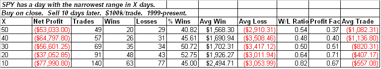

<!--yml
category: 未分类
date: 2024-05-18 13:22:00
-->

# Quantifiable Edges: Very Narrow Range

> 来源：[http://quantifiableedges.blogspot.com/2009/05/very-narrow-range.html#0001-01-01](http://quantifiableedges.blogspot.com/2009/05/very-narrow-range.html#0001-01-01)

Tuesday’s SPY range was the lowest in over 3 months. Since 1999 there has been a bit of a downside bias following narrow range days. The narrower the range in relation to recent ranges, the more bearish the inclination has been. Below is a table showing the 10-day returns following a day that was the narrowest range in X days:

Of course this morning the excitement over the jobs report seems to be trumping any narrow-range tendencies so far.